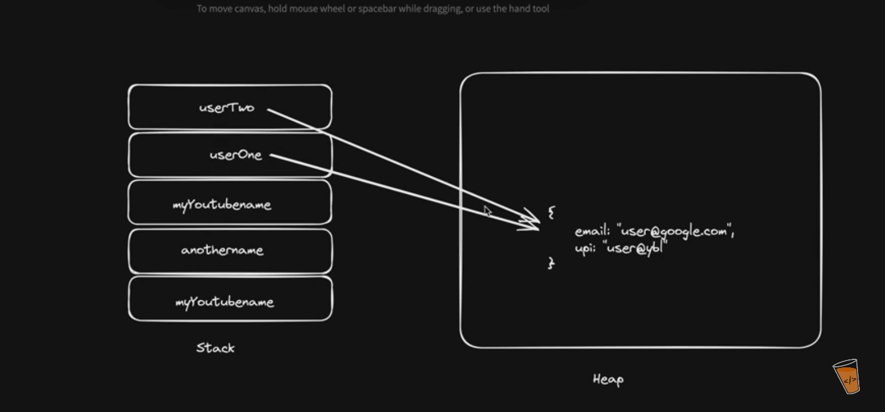
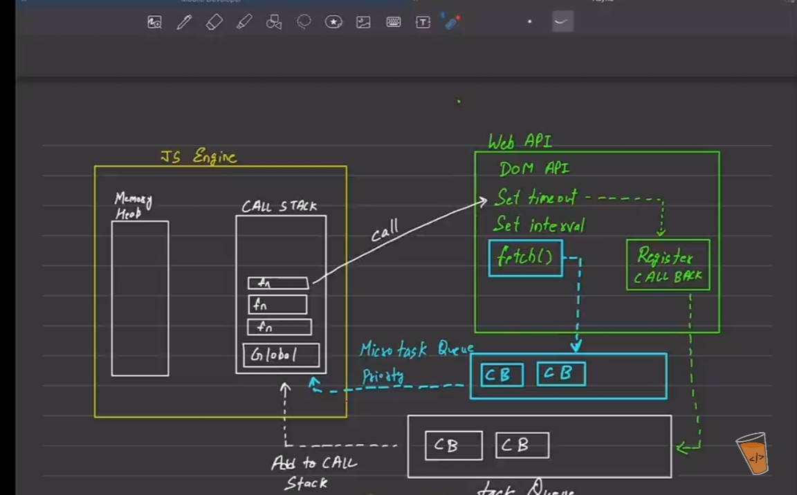
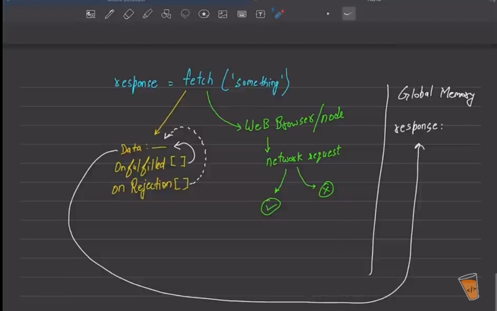
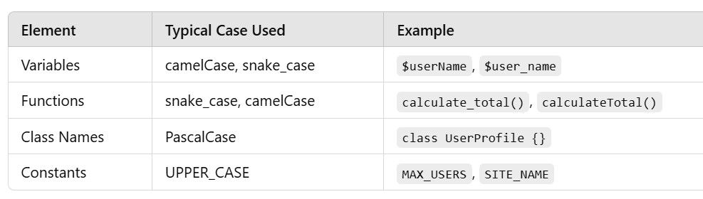
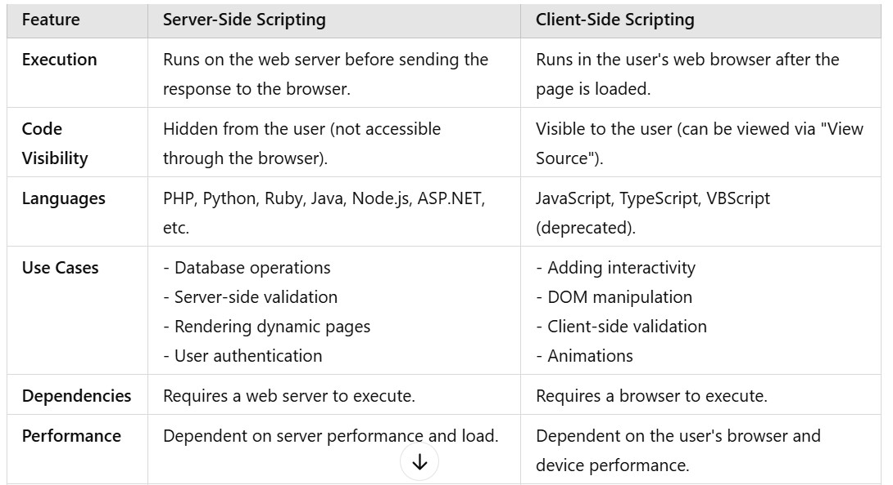
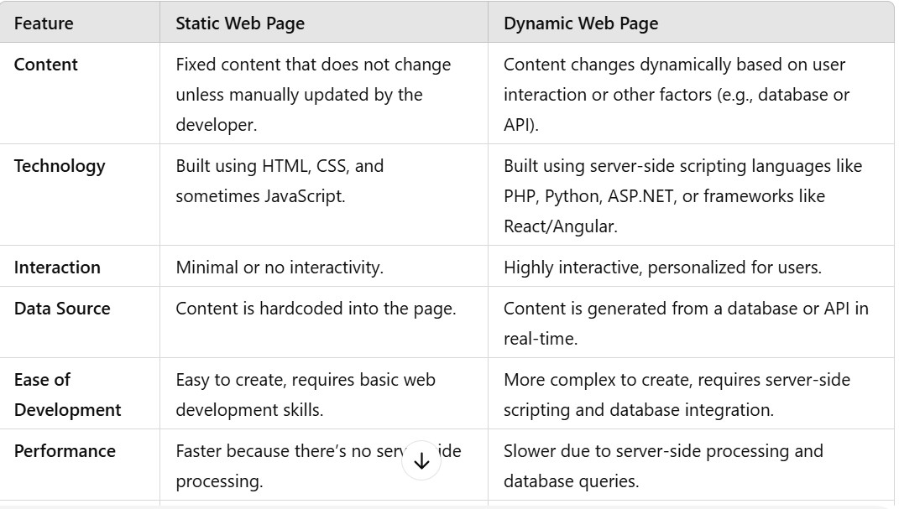

# HTML

It stands for Hypertext markup language which is used to create webpages.It uses tags and attributes to provide
structure and format to the webpages.

# Hypertext :

It is a text which contains links to other texts.

# Why Markup language :

It is used to defines the text documents within the tags to structure webpages. Here tags are also called Markup.

# Note :

HTML files are saved with .html or .htm extension.
<br>
combination of html tags and contents are called html elements .
<br>
HTML is called as language of the browser because browser understands html .

<br>
ASP : Active server pages
MDN : Mozilla developer network

# HTML tags and attributes :

Tags are the containers in html for some content or other html tag.
tags are like keywords which defines that how web browser will format and display the content.
<br>
attributes provide the additional information about the tags .

# Types of HTML elements :

1. Block elements
   <br>
   HTML Block elements, are used to structure the main content of a webpage. They typically start on a new line and take up the full width of their container(i.e. body) examples div, p, h1 to h6, and ul, etc.
   <br>
2. Inline elements
   <br>
   It does not start on a new line and takes up only the necessary width.examples : br,span etc

# head tag in Boilerplate code

It is used to write scripting(both client and server) to make dynamic web pages.It also contains page metadata.

# title tag

It is the subtag of head tag. It is used to show the title of webpages.

# formatting tags

These type of tags are applied on the text.

# Types of HTML tags :

Semantic tags : These are the tags which are understandable to what task they actually perform.
ex- header, footer etc
<br>
Non Semantics tags : These are the tags which are not understandable to what task they actually perform.
ex- div tag etc.

# Important Point from form :

In radio button name attribute of different options is same.

<br>
In form tag , action attribute is used to defines what actions need to be performed when the form is submitted.

<br>

<b>method attribute in form :</b>
<br>
<b>method="GET"</b>This method is used when we want to retrieve data, make a search, or when the form data is not sensitive and can be included in the URL.

<b>method ="POST"</b> It is used when the  form data is sensitive, when the form submission will change server-side data, or when you need to send a large amount of data.

<b>for attribute in label in form :</b> is used to associate the label with a specific form control such as input , textarea, select.

<b>name attribute in input form :</b>It is used for server side processing.
<br>
When a form is submitted, the browser sends a key-value pair for each input. The name attribute provides the key, and the value is whatever the user has entered or selected.

<b>id attribute in input form :</b>
The id attribute is commonly used to associate a label with an input field using the for attribute in the label element. This association allows users to click on the label to focus the corresponding input field.
<br>
For this purpose value of for and id attribute is same.

# Iframe tag

Iframe tag is used to provide link of another website in a website.
There are some websites link which we cannot use to as a part of our website like google.

# Video tag and audio tag

Video tag is used to show the Video on our websites.
<br><br>
Attributes of Video tag :
<br>

1. src : It is used to provide relative or absolute url.
   <br>
2. controls : It is used to provide extra functionality like play ,download, resize of video etc.
   <br>
3. height and width attributes : It is used for size.

<br>

4. loop :
   It is used when we want to restart the video after complete once.

<br>
5 . autoplay :
It makes video autoplay when the webpage opens.

<br>

6 . muted : for the muted video plays.

# Frames
A frame is a layout-defining element that splits a browser window into multiple frames, each with its own contents. Frames are no longer supported by HTML 5 and are unlikely to be used unless working with a pre-HTML5 webapp. 

# IFrames
An iframe is a content-adding element that embeds another HTML page within the current document. IFrames are commonly used to insert content from external sources, such as advertisements, embedded videos, and interactive content. IFrames can float within the webpage and be positioned at a specific location. 

# HTML5 Data Storage:
HTML5 provides two main mechanisms for data storage on the client side:

<h1>1. Web Storage:</h1>

Web Storage consists of localStorage and sessionStorage. These allow key-value pair storage in a more efficient and structured way compared to cookies.

<b>localStorage</b>
Localstorage is web storage object which are not sent to server with each request .
This store the data in the form of key value pairs and did not gone after refresh.
It allows data to persist even after the browser is closed.
<br>
Key Features:


Stores up to ~5MB of data.
Stored data is domain-specific.(It means If you store data using localStorage on https://example.com:

The data is available only to pages on https://example.com.
It will not be accessible to:
A different subdomain like https://sub.example.com.
)
Accessible via the localStorage object.
<br>
Several Methods provided by the Localstorage:
<br>
```bash
1. setItem(key, value)
Description: Stores a key-value pair in localStorage.
Example:
localStorage.setItem('username', 'JohnDoe');

2. getItem(key)
Description: Retrieves the value associated with the given key.
Example:

const username = localStorage.getItem('username'); // Returns 'JohnDoe'


3. removeItem(key)
Description: Removes the key-value pair associated with the given key.
Example:

localStorage.removeItem('username');

4. clear()
Description: Removes all key-value pairs from localStorage.
Example:
localStorage.clear();

5. key(index)
Description: Retrieves the key at the specified index (keys are stored in insertion order).
Example:
const firstKey = localStorage.key(0); // Returns the first key

6. Length Property (localStorage.length)
Description: Returns the number of key-value pairs stored in localStorage.
Example:
const itemCount = localStorage.length; // Number of stored items

Notes:
Data stored in localStorage is stored as strings. To store objects or arrays, you need to stringify them using JSON.stringify and parse them back using JSON.parse:

const user = { name: 'John', age: 30 };
localStorage.setItem('user', JSON.stringify(user));

const storedUser = JSON.parse(localStorage.getItem('user'));
console.log(storedUser.name); // Outputs: John

localStorage is synchronous and available in all modern browsers. It shares storage across all tabs and windows of the same origin.


```

<br>
<br>

<b>sessionStorage</b>
Description: Stores data for the duration of a session.Data remains persist after refresh the same tab but Data is cleared when the browser tab is closed.
<br>
Key Features:
Similar to localStorage, but temporary.
Accessible via the sessionStorage object.
<br>
Several methods provided by sessionStorage (sessionStorage has also same methods that localStorage has):
```bash
// Save data
sessionStorage.setItem('username', 'JaneDoe');

// Retrieve data
const username = sessionStorage.getItem('username');

// Clear data
sessionStorage.clear();
```
<br>

<b>onstorage Event :</b>
<br>
The onstorage event is triggered when changes are made to the localStorage of a web page. However, there are specific conditions and behaviors associated with this event.
<br>
```bash 
window.onstorage=(e) =>{
  alert("Changed");
}

```
<br>
When Does the onstorage Event Trigger?
<br>
It triggers when a key in localStorage is added, modified, or removed.
It only fires for other windows or tabs from the same origin. This means:
If you modify localStorage in one browser tab, the onstorage event will fire in other tabs or windows of the same origin.
It does not trigger in the same tab where the change was made.
Note: onstorage does not work for sessionStorage.
<br>

<h1>2. IndexedDB</h1>
A low-level API for storing large amounts of structured data, including files and blobs(Binary Large Object) like videos,images etch. Ideal for web applications needing complex queries and high performance.
<br>
Key Features:
<br>
Stores large amounts of data (more than 50MB in most browsers).
<br>
Allows transactions and indexed searches.
(Transactions in IndexedDB are used to group multiple read and write operations into a single atomic operation, ensuring data integrity.
IndexedDB allows you to create indexes on specific fields in your object stores, enabling quick and efficient searches.)
<br>
Example of Transaction :
<br>
```bash 
// Open a database
const request = indexedDB.open("MyDatabase", 1);

request.onsuccess = function (event) {
  const db = event.target.result;

  // Create a transaction
  const transaction = db.transaction(["users"], "readwrite");

  // Access the object store
  const store = transaction.objectStore("users");

  // Add data to the object store
  const addRequest = store.add({ id: 1, name: "John Doe", age: 30 });

  addRequest.onsuccess = () => {
    console.log("Data added successfully!");
  };

  transaction.oncomplete = () => {
    console.log("Transaction completed successfully.");
  };

  transaction.onerror = (err) => {
    console.log("Transaction failed: ", err);
  };
};

```
<br>
Supports asynchronous operations.

Accessible via the indexedDB object.
<br>
Example:
<br>
```bash
const request = indexedDB.open('myDatabase', 1);

request.onsuccess = function (event) {
  const db = event.target.result;
  console.log('Database opened successfully');
};

request.onupgradeneeded = function (event) {
  const db = event.target.result;
  const objectStore = db.createObjectStore('users', { keyPath: 'id' });
  objectStore.createIndex('name', 'name', { unique: false });
};

```
<br>
Note : IndexedDB is primarily designed for persistent storage, meaning that data stored in IndexedDB remains available even after the browser is closed or the device is restarted.
<br>
<br>

<b>3. Cookies (Legacy)</b>
Cookies store small strings of data (up to 4KB) and are often used for session management, user tracking, and maintaining state between server and client. It is also stored in the form of key value pairs.
Example : unique id is given by each user by the web server stores in the cookies and when the same user visited the same website the cookie data will be send to server.

<br>
Key Features:
<br>
Data can be sent automatically to the server with every HTTP request.
Accessible via document.cookie.
Can have expiration times.
<br>
Example:
<br>

```bash

// Set a cookie
document.cookie = "username=JohnDoe; expires=Fri, 31 Dec 2024 23:59:59 GMT; path=/a";

Note : This does not override the cookie but only add this cookie to the previous cookies.
Here cookie also provides several options after key= value to a set call.
path= /a :  means cookies is visible at /a .
expires set the expiration date.


Note : If we update the same key with different key then value associated with that key will be upated and no new key-value will be formed.

Note : when we want to set specialcharacters(like =,!) as key then it will not set then in this case we need to encode them :
document.cookie = encodeURIComponent("@3=;") + '=' + encodeURIComponent("234#4=");

The key = value after encodeURIComponent should not exceed 4KB.
Total No of Cookies per domain is limited to around 20+ (browser dependent).

If we want to decode it then we can also decode it.
decodeURIComponent("@3=;");


// Retrieve cookies
console.log(document.cookie);

```


# Canvas :
The getContext("2d") method is used to create a drawing context on the canvas.
The "2d" parameter specifies that the context is for 2D graphics.
This context provides methods and properties to draw shapes, text, images, and other graphics on the canvas.

<br>
The stroke() method in the HTML5 Canvas API is used to draw the outline of a shape or path. It renders the visible stroke (or border) based on the current stroke style, width, and other properties defined in the CanvasRenderingContext2D object.
<br>

The <b>beginPath()</b> method begins a path or resets the current path.
<br>
ctx.arc(95, 50, 40, 0, 2 * Math.PI);
<br>
Here (95,50) is the position of center and 40 is the radius and 0 is the starting angle and 2*Math.PI is the ending angle.
<br>
ctx.fillText("Hello World", 10, 50);
<br>
Here (10,50) represents x and y coordinates.
<br>


Explanation of createLinearGradient(0, 0, 200, 0);:
<br>
(0, 0): This is the starting point of the gradient at the top-left corner of the canvas.
<br>
(200, 0): This is the ending point of the gradient, 200 pixels to the right of the starting point, at the same vertical level.
<br>
The gradient will transition horizontally from the starting point to the ending point.
<br>

ctx.fillRect(x, y, width, height);
<br>
x: The x-coordinate (horizontal position) where the top-left corner of the rectangle will start.
<br>
y: The y-coordinate (vertical position) where the top-left corner of the rectangle will start.
<br>
width: The width of the rectangle.
<br>
height: The height of the rectangle.

<br>
ctx.drawImage(img, 10, 10);
<br>
Here (10,10) represents the x and y coordinates.

<br>

```bash
Explanation of createRadialGradient(75, 50, 5, 90, 60, 100);  

75, 50: The center of the inner circle (starting point) is at (75, 50).

5: The radius of the inner circle is 5 pixels.

90, 60: The center of the outer circle (ending point) is at (90, 60).

100: The radius of the outer circle is 100 pixels.

```

# difference b/w svg and canvas:

# UI (User Interface) :

User Interface (UI) design focuses on the visual and interactive elements of a digital product. It is about creating interfaces that users interact with, including buttons, icons, layout, typography, colors, and animations.

# UX (User Experience):

User Experience (UX) design is about creating a seamless, efficient, and satisfying experience for the user while they interact with a product. It involves understanding users' needs and ensuring that the product is easy to use, accessible, and delivers value to them.

# CSS : Cascading style sheet

CSS is a language which is used to provide styling to a website.

# Specificity : 
!important > internal css > id selector > class selector > attribute selector > element selector 
<br>
```bash 
// specificity value 
!important = Infinity
internal style = 1000
id = 100
class = 10
element = 1 

```

# Cascading Rule : 

```bash 
Order of precedence (from lowest to highest):

Browser default styles

External stylesheets (linked)

Internal styles

Inline styles

!important declarations override all others (use with caution)


// If the two elements have same specificity value then css which has written firstly will be overrided by the last one. 

```
# Inheritance : 
All the text related property are inheritable.  
<br>
Some property is not inherit by default because browser apply some properties on it. 
<br>
But we can inherit property. 
<br>
```bash 

body{
  font-style:italic
}
font-style: inherit;

```

# How to link a html with css files
```bash 
<link rel="stylesheet" href= "style.css">
```

# There is id element and element id selector in css:

#main div{background-color:white;}
<br>  
div#main{color:white;}

# Background:

1. Use Linear-gradient color
<br>
```bash
background-color:linear-gradient(to right,red,yellow);
```

<br>

2. background-attachment :
<br>
```bash
background-attachment:fixed;

it can be fixed,scroll.

```

# Background-Image

```bash
background-image: url("photographer.jpg"); /* The image used */
background-color: #cccccc; /* Used if the image is unavailable */
height: 500px; /* You must set a specified height */
background-position: center; /* Center the image */
background-repeat: no-repeat; /* Do not repeat the image */
background-size: cover; /* Resize the background image to cover the entire container */


Note we can add more than one images to background But first image wil apply first and other image will apply behind the first one.

```
# To prevent overflow : 
```bash 
//use max-width and min-height 

// use unit em and change the font-size of parent's element. 

```

# To fixed the content of webpage in center for every screen :
```bash  
body{
  max-inline-size:1000px; // The max-inline-size property specifies the maximum size of an element in the inline direction.
  margin-inline:auto; // equally distribute space in left and right of content. 
}
```

# padding :

It is used to fit text in a container properly.
<br>
```bash
padding:5px 6px
here 5px is for top and bottom,
6px for Right and left

padding:5px 6px 7px
here 5px is for top ,
6px is for Right and left,
7px is for down

padding:1px 2px 3px 4px
here 1px is for top, 2px for right , 3px for down
and 4px for left

padding-top:5px
padding-right :6px
padding-down :7px
padding-left :3px

padding:4px
here padding top,right,down,left are 4px.
```

# Margin :

margin is used to provide space between html elements

# Shorthand for border:

Border is used to round the corners of html element's border edge.
<br>
border: 1px solid black;
<br>
In border attribute 1px is width, solid is style and black is color. This is short hand way.

# display

if display is block , we can set width,height,padding and margin.
<br>
If display is inline , padding,border and margin works in left-right direction. 

# Inline Element: 
There are two types of inline element : 
<br>
1. Non Replaced Inline Element : Element which have some general content . like : anchor, span etc. 
Here height and width does not work. They are auto . 

<br>
2. Replaced Inline Element : Element which does not have some general content. like : img,iframe,video,object etc. 
Here height,width,padding,border and margin works. 

# text-align and text-decoration and text-transform

```bash
text-align : left,right, center

text-decoration : overline

It means the line over the text.

text-decoration : line-through;

It means that there is a line on the text.


text-transform : upercase,lowercase,capitalize,none;


```

# line-height

```bash
/* Keyword value */
line-height: normal;

/* Unitless values: use this number multiplied
by the element's font size */
line-height: 3.5;

/* <length> values */
line-height: 3em;

/* <percentage> values */
line-height: 34%;
```

# overflow :

The CSS overflow property controls what happens to content that is too big to fit into an area.
It works for only Block elements.
<br>
```bash
overflow : hidden;
overflow: visible;
overflow:scroll;
overflow :none;


It can be overflow-x or overflow-y;
```

# font-weight :

It makes the font lighter or dark .It's value lies b/w 100 -900.

# font-varients :

The font-variant property in CSS is used to control the usage of different font variants in a text. It allows you to enable or disable the use of alternative glyphs within a font, like small caps or old-style numerals.

# font-style :

It can be normal,italic and oblique.

# em unit :
Note :  when we set font-size in em and and set any another property's value in em then property's value will changes acc to its own element's font-size. 
<br>
like : 
if font-size :2em in a child div
<br>
then other property like width : 2em then it means width becomes 2 times of its own font-size.It does not depend on parent font-size.
<br>
Example:
<br>
```bash

<div class="container" style="font-size: 3em;">

  <!--In parent div the font-size is 3em means 48px-->

  <div class="box1"> <!-- font-size:48px -->
      <p style="font-size: 2em; width:2em;background-color: aqua;">Lorem ipsum dolor sit amet consectetur, adipisicing elit. Sit reiciendis et hic exercitationem, mollitia iure esse quaerat expedita, voluptatem maiores, porro eos saepe deserunt est voluptates eaque nihil nisi totam?</p>

      <!--IN paragraph font-size is 2em means 2 * 48 px => 96px and width is 2em means 2 * 96 = 192px-->


  </div>
</div>

```

# height : 90 vh and width : 1wh

here vh means viewport height.

<br>
1 vh is equal to 1% of the height of the viewport and same as in vw.

# z-index;

when the two elements are overlapping then with the use of z -index ,we can specify which element will be show in upper layer or lower layer . Basically whose z -index is maximum,that will show in upper layer.
<br>
It only works on elements with a position value of:

relative

absolute

fixed

sticky

# position : static ;
Elements follow the normal document flow.
<br>
Ignores top, right, bottom, left, and z-index.

# position:relative;
The element is positioned relative to the browser window(normal position).
we can set top,right,bottom,left by using inset.
<br>
```bash 
position:relative;
inset:5px; // here left,right,top,bottom will be 5px. 

```

# position:absolute;

An element with position: absolute is positioned relative to its nearest parent that has a position value other than static (e.g., relative, absolute, fixed, sticky).
<br>
If there is no such ancestor, it will be positioned relative to the initial containing block, which is typically the browser window or viewport.
<br>
Offset properties (top, right, bottom, left) determine how far the element is positioned from its containing block's edges.

# position:fixed;
Positioned relative to the viewport (browser window).
<br>
Stays fixed even when scrolling.

# position:sticky;
Acts like relative until a scroll threshold is reached, then behaves like fixed.
<br>
Requires top, right, bottom, or left to define the sticking point.


# list-style-position:

It can be inside and outside.
<br>
The list-style-position property specifies the position of the list-item markers (bullet points).

# float property :

When we use the float property, and we want the next element below (not on right or left), we will have to use the clear property.
<br>
```bash
clear : left ;
clear :right;
clear : both;
clear :none;
```

# flex-box

It is a one-dimensional layout method for arranging items in rows or columns.

# flex-direction:

It sets how flex items are placed in the flex container, along which axis and direction.
<br>
flex-drection:row;
<br>
It means the starts of main axis in the flex container.
<br>
flex-drection:column;
<br>
It means the starts of cross axis in the flex container.
<br>
flex-drection:row-reverse;
It means the end of main axis in the flex container.

<br>
```bash 
<div style="display: flex;">
  <span style="width: 23px; height: 34px;"></span>
</div>

// When parent has display flex then we can set the width and height of inline elements. 

```

# justify-content:

Aligns flex items along the main axis.
<br>
flex-start (default): Items are aligned at the start of the container.
<br>
flex-end: Items are aligned at the end of the container.
<br>
center: Items are centered along the main axis.
<br>
space-between: Items are evenly distributed; the first item is at the start, the last at the end, and the space between items is equal.
<br>
space-around: Items are evenly distributed with equal space around each item but the first and last items are separated by space which is half of space in between the other items.
<br>
space-evenly: Items are evenly distributed with equal space between and around items.
<br>

# align-items:

Align items along cross axis.
<br>
stretch (default): Flex items stretch to fill the container (if the item's height is not explicitly set).
<br>
flex-start: Items are aligned at the start of the cross axis.
<br>
flex-end: Items are aligned at the end of the cross axis.
<br>
center: Items are centered along the cross axis.
<br>
baseline: Items are aligned such that their baselines align.
<br>

# align-content:

Aligns the flex lines (when there are multiple lines due to wrapping or more space between the components) along the cross axis.
<br>
stretch (default): Lines stretch to fill the container.
<br>
flex-start: Lines are packed at the start of the cross axis.
<br>
flex-end: Lines are packed at the end of the cross axis.
<br>
center: Lines are packed in the center of the cross axis.
<br>
space-between: Lines are evenly distributed with no space at the edges.
<br>
space-around: Lines are evenly distributed with space around them.
<br>
space-evenly: Lines are distributed evenly with equal spacing between and around them.

# align-self

Overrides the align-items property for individual items.(means if any other property of align-item are applied on many div then using align-self property we can align an individual item into different direction.)
<br>
auto (default): Inherits the align-items value from the container.
<br>
Other values: flex-start, flex-end, center, baseline, stretch.

# order

Controls the order in which flex items appear when multiple items are aligned in a line .
<br>
Default value is 0. Items with lower order values appear first.

# flex-wrap :
```bash
flex-wrap:wrap;
// it can be no-wrap (default)
// it can be wrap-reverse
```
<br>
The flex-wrap CSS property sets whether flex items are forced onto one line or can wrap onto multiple lines. If wrapping is allowed, flex-items goes to next line if space is not available.

# flex:flex-grow flex-shrink flex-basis
flex-grow : A number specifying how much the item will grow relative to the rest of the flexible items.
Default: 0 (do not grow)
<br>
flex-shrink : A number specifying how much the item will shrink relative to the rest of the flexible items.
Default: 1 (can shrink).
If set to 0, the item won't shrink even if there's not enough space.
<br>
flex-basis : This property specifies the initial length of a flexible item. Legal values: "auto", "inherit", or a number followed by "%", "px", "em" or any other length unit.

<br>


# display :grid;

Grid display provides a grid-based layout system with rows and columns. Bydefault it provides a single row and column.

<br>
Note : A responsive grid-view often has 12 units of columns, and has a total width of 100%, and will shrink and expand as you resize the browser window.
<br>

# gap property of grid :

Use the gap property to specify the size of the gap between the rows and the columns. like : gap:30px;

# grid-row and grid-column:

grid-column: <start-line> / <end-line>;
grid-row: <start-line> / <end-line>;

grid-row :1/3;
here it means grid starts from 1 line of row and end to third line of row.

# grid-area

A shorthand to define the row and column positions of a grid item. It can also be used in conjunction with named grid areas.

Syntax: grid-area: <row-start> / <column-start> / <row-end> / <column-end>;
Example: grid-area: 1 / 2 / 3 / 4; (the item starts at row line 1, column line 2, and ends at row line 3, column line 4).

# grid-template-areas

Allows you to create named grid areas and define a visual layout by assigning names to different sections of the grid.

Syntax:

Define grid areas using a string of names:
<br>
grid-template-areas: "header header" "sidebar content" "footer footer";
<br>
Assign grid items to areas with the grid-area property.

```bash
.item1 { grid-area: header; }
.item2 { grid-area: menu; }
.item3 { grid-area: main; }
.item4 { grid-area: right; }
.item5 { grid-area: footer; }


.grid-container {
  display: grid;
  grid-template-areas:
  'header header header header header header'
  'menu main main main right right'
  'menu footer footer footer footer footer';
  grid-gap: 10px;
  background-color: #2196F3;
  padding: 10px; 
}

.grid-container > div {
  background-color: rgba(255, 255, 255, 0.8);
  text-align: center;
  padding: 20px 0;
  font-size: 30px;
}

<div class="grid-container">
  <div class="item1">Header</div>
  <div class="item2">Menu</div>
  <div class="item3">Main</div>
  <div class="item4">Right</div>
  <div class="item5">Footer</div>
</div>


```

<br>
Note : we can set the width of each column by :
<br>
grid-template-columns: 50px 50px 50px;

# Alignment in Grid

justify-items :
Aligns grid items along the inline (row) axis.
<br>
Values: start, end, center, stretch (default).

<br>
align-items : 
Aligns grid items along the block (column) axis.

Values: start, end, center, stretch (default).
<br>
justify-content
Aligns the entire grid within the grid container along the row axis.

Values: start, end, center, stretch, space-around, space-between, space-evenly.
<br>
align-content
Aligns the entire grid within the grid container along the column axis.

Values: start, end, center, stretch, space-around, space-between, space-evenly.
<br>
place-items :
A shorthand for setting both align-items and justify-items at the same time.

Syntax: place-items: <align-items> <justify-items>;
<br>
place-content :
A shorthand for setting both align-content and justify-content at the same time.

Syntax: place-content: <align-content> <justify-content>;

<br>

# minmax()

Defines a size range for a grid track.
<br>
Syntax: minmax(min, max);
<br>
Example: grid-template-columns: minmax(100px, 1fr); (column will be at least 100px, but grow as much as 1fr).
<br>
The column will be at least 100px wide, even if the container is smaller.
<br>
As the container's width increases, the column can grow up to take 1fr of the remaining space, behaving like a fraction of the available space.

# fr (Fraction Unit)

The fr unit represents a fraction of the available space in the grid container. It's used to divide remaining space between columns or rows.
<br>
Example: grid-template-columns: 1fr 2fr; (the second column gets twice the space of the first column).

<br>
In the example 1fr 2fr, the total number of fractions is 1 + 2 = 3.
<br>
The available space is divided into 3 equal parts:
<br>
The first column gets 1 part (1/3 of the available space).
<br>
The second column gets 2 parts (2/3 of the available space).

# box-shadow : 

```bash
box-shadow:10px 10px 4px rgba(0,0,0,0.1)
10px 10px: horizontal and vertical offset (shadow is 10px down and 10px to the right)

4px: blur radius

rgba(0,0,0,0.1): shadow color is black with 10% opacity
```

# translate(x-axis , y-axis);

Here element move right and left acc. to x-axis and move up and down acc. to y-axis.
<br>
It can also done by this way.

```bash
translateX();
translateY();

we can pass negative value to translate property.
when translate(-50%,-50%) then it moves 50% left of its own width and 50% up of its own height.

```

# rotate(20deg);

Here value of deg can be negative.

# scale(width_times,height_times);

scale(2,3);
Here the elements width becomes 2 times and height becomes 3time of its original height.
<br>
It can also done by this way:
<br>
scaleX(2);
scaleY(3);

# skewX(20deg) and skewY(30deg);

The skewX() method skews an element along the X-axis by the given angle.
<br>
The skewY() method skews an element along the Y-axis by the given angle.
<br>
It can also done by this way:
skew(20deg,30deg);

# transform : matrix(scaleX(), skewY(), skewX(), scaleY(), translateX(), translateY())

The matrix() method combines all the 2D transform methods into one.

# Some transform properties of grid for 3d:

rotateX(); // rotate along x-axis
<br>
rotateY(); // rotate along Y-axis
<br>
rotateZ(); // rotate along Z-axis.

# Transition

```bash
tansition: property_name duration timing-function delays

The transition-timing-function property specifies the speed curve of the transition effect.

The transition-timing-function property can have the following values:

ease - specifies a transition effect with a slow start, then fast, then end slowly (this is default)
linear - specifies a transition effect with the same speed from start to end
ease-in - specifies a transition effect with a slow start
ease-out - specifies a transition effect with a slow end
ease-in-out - specifies a transition effect with a slow start and end
```

# media query:
Media Queries used with "min-width/max-width or min-height/max-height"
<br>

```bash
@media (min-width:200px) and (max-width:400px){}

// It means when the screen size is between 200px and 400px.

@media only screen and (max-width:200px){
    body{
    background-color:blue;
    }
}

//  only : This is a keyword that prevents older browsers that don't support media queries from applying the styles. It's optional and used mostly for browser compatibility.

//  screen : It tells the browser you want to apply styles when the media type is a screen . 
// Other media types: 

print: for printed pages
screen: for computer screens, tablets, phones

all : means both print and screen. 
```

# aspect-ratio:

ex-> aspect-ratio:16/5; Here it means
<br>
For a width of 1600 pixels, the height would be
1600÷16/5 =500 pixels.
<br>
For a height of 500 pixels, the width would be 500 ÷ 5/16 =1600 pixels.

# object-fit: cover:

The image or video will fill the container completely.
Parts of the content may be cropped if its aspect ratio doesn't match that of the container.
The content will not be stretched; it will scale proportionally.


# element::after 

The h1::after selector in CSS is a pseudo-element that is used to insert content after an h1 element. It allows you to add content or apply additional styles without modifying the actual HTML.
```bash
h1::after {
  content: "";
  /* Additional styles here */
}

```

# JavaScript

JavaScript is a scripting language that does not require compilation.
<br>
JavaScript is a dynamically typed language.
<br>
ECMAScript is a standard for a scripting language. It specifies the core features that a scripting language should provide and how they works.
<br>
for the convention of variables and methods , we use camel case.

# Important Point from JS Execution:

```bash 

// when we run any js code then two things happen :
1. Memory Creation Phase : Reserve Memory for variables and function in Global Execution Context. 
Intially in the Global Execution Context, all the variable stored with undefined value
and Functions are stored with function body. 

2. Code Execution phase in which code is executed by js engine. 


// Important Point : 
function first(){
  console.log("first");
  second();
}

function second(){
  console.log("second");
}


// In this case execution context of second function is created in execution context of 
// first function and first function is in the global execution context. 


```
<br>
<br>

```bash 
// Important Point : 

const John = {
  name : "John"
  sayName: function(){
    console.log(this.name)
  }
}

const David = {
  name : "David"
  sayName: function(){
    console.log(this.name)
  }
}

David.sayName.call(John) ;
// O/P => John  

It is because "David.sayName" uses the Global Execution Stack of John. 


// Another Important Que : 
for(var i =0 ;i < 10 ; i++){
  setTimeout(()=>{console.log(i)},0);
}

// Here It will print ten times 10 because var is globally scoped. 
In this case, first complete for loop runs and 3 setTimeout function will be stored in Execution stack which will be executed later. 


// Another Important Ques : 
const Rohan = {
  name:"Rohan",
  sayName : function(){
    console.log(this.name);
  }
}

setTimeout(Rohan.sayName,3*1000);
// O/P : undefined 

Because setTimeout executes separately so when setTimeout executes "Rohan.sayName" does not know its execution context. 

setTimeout(Rohan.sayName.bind(Rohan),3000)

// O/P : Rohan 
Because bind will first bind the execution stack with the execution stack of "Rohan.sayName" and then call it. 

setTimeout(()=> Rohan.sayName() , 3000)
// O/P : Rohan 


const obj = Object.create({
  height:30;
});
console.log(obj.height);
delete obj.height;

console.log(obj.height)


// O/P : 30 
         30 

Because when we create object by "Object.create" then all the properties will be stored in the prototype of object and delete does not work on prototype but if normally create object without "Object.create()" then in that case last "obj.height" will print "undefined".

```
<br>
<br>
```bash 
var declared in IIFE function will have local scope.

var declared in block have global scope by default. 

If block is declared inside function and it contains variable declared with "var" 
then that variable is only accessible inside that function.  

```
# Lexical Scope :
Inner functions can access variables from outer functions and global execution context, but not vice versa.
<br>
```bash 
var a = 90;
let b = 40;
function first(){
  let b = 20;
  console.log("first");
  second();
}

function second(){
  console.log(this.a);
  console.log("second");
  let b = 30;

  function third(){
    console.log(b);
  }
  third()
}

first();


O/P : 
first
90
second
30

```
# Returning Funtion with Closure: 
A closure is a function that remembers the variables from its outer (lexical) scope, even after that outer function has finished executing. 
<br>
```bash 
function outer() {
  let count = 0;

  return function inner() {
    count++;
    console.log(count);
  };
}

const counter = outer();  // outer() runs, returns inner
counter(); // 1
counter(); // 2
counter(); // 3

```


# Hoisting : 
Hoisting will take place in case of "var" and funtions defined with function keyword and function name. 
<br>
In case of "let" hositing take place but JS makes "Temporal Dead Zone" for the code above from the "let" declaration which does not allows JS to access "let" variable before its intialization.

# Variables :

var is globally scoped and let and const are block scoped.
<br>
Bydefault var stored in memory of global execution context and we can access it with "window.variable_name"  
<br>
var can be re-declared and updated.
<br>
let cannot be re-decalard but can be updated.
<br>
const cannot be re-declared and cannot be updated.
<br>
using let keywords we can declare variables without intialization.
like : let a;
In this case undefined value is assigned to variables.
<br>
Note : we can also declare variables using const keyword.
<br>
If you re-declare a JavaScript variable, it will not lose its value.

var carName = "Volvo";
var carName; // Volvo

<br>

// JavaScript will try to convert strings to numbers in all numeric operations:
```bash
var x = "100";
var y = "10";
var z = x / y;       // z will be 10 // type will be number
var z = x * y;       // z will be 1000
var z = x - y;       // z will be 90
var z = x + y;       // z will not be 110 (It will be 10010)
```

<br>
var a = 'This is valid outer in "single Quote " and inner in double quote';

<br>
 In JavaScript, the data type of null is an object.
 <br>

```bash
// some rarely used primitive datatypes
let bigintValue = BigInt(3435); // using BigInt() function
console.log(bigintValue);

// use for the sentences.

let symbolValue = Symbol("This is for symbol");
console.log(symbolValue);

// Symbol is primarily used to create unique identifiers for object properties. Unlike strings or numbers, each Symbol is guaranteed to be unique, even if they have the same description.

let sym1 = Symbol('id');
let sym2 = Symbol('id');

console.log(sym1 === sym2); // false, because every Symbol is unique

// how to check the datatype
console.log(typeof symbolValue);


// Primitive type ( value type)

// Non primitive Data type (Reference type ): 
There is only "object" which is non primitive datatype : 
There are different form of object in js.

Object Literals
Array
Function

```
# Important Point from math operation between variable:
```bash 
"5" - "2" → 3 (Strings behave like numbers unless + is used)

null == 0 → false, but null + 0 → 0

undefined == null → true, but undefined + 1 → NaN

// Important Point from NaN: 
console.log(NaN == NaN); // false
console.log(NaN === NaN) // false

"10abc" * 1 → NaN (not a pure numeric string)

Boolean(" ") → true (non-empty string is truthy)

true + 1 => 2 

true + "a" => truea


```

# Math Object :
The Math object in JavaScript is a built-in object that provides a collection of mathematical constants and functions.
<br>
```bash
// By default Math.random() give random double value between 0 and 1. 
const result = Math.floor(Math.random()*20)+10
console.log(result)

// Here it gives number between 10 and 20 ;

```


# Difference between Function and Method :
Method : Function defined in object or class.
<br>
Function : Funtion defined outside the object or class. 


# Stack and Heap memory : 
All the primitive datatypes are stored in Stack memory and From stack memory, copy of the variable's values are used. 
<br>
All the non primitive datatypes are stored in the Heap memory and a reference is passed to variables which use it and these reference are stored in stack memory. 
<br>
 

# Conditional Statements :
when we want to execute a block of code based on certain conditions then we use conditional statements.

# Important Point from For loop : 
when we declare a variable inside for loop using let keyword then a new variable is created for each block of block in each iteration. 
<br>
```bash
<!-- for(let i = 0 ;i <3;i++){
  setTimeout(()=>{console.log(i)},200)}  -->

  // OP: 0 1 2 
```

# String

String are immutable.
every String methods returns a new String.
It does not change in the old ones.

# Important point from JS String :
```bash 

The replace() method does not change the string it is called on. It returns a new string.

By default, the replace() function replaces only the first match:

str = "Please visit Microsoft and Microsoft!";

By default, the replace() function is case sensitive :
var n = str.replace("MICROSOFT", “IBM");

To replace case insensitive, use a regular expression with an /i flag (insensitive):
var n = str.replace(/MICROSOFT/i, “IBM");

To replace all matches, use a regular expression with a /g flag (global match):
var n = str.replace(/Microsoft/g, “IBM");

```
# Escape Sequence characters:
Escape sequence characters in JavaScript are special combinations of characters that start with a backslash (\).
<br>
A character escape represents a character that may not be able to be conveniently represented in its literal form.

# Arrays

Arrays are mutable.
<br>
Most of the array method will change in the existing array.
<br>
Some methods will create a new array.
<br>
<b>like : concat(),slice() </b>

<br>
<b>Important point from Arrays method :<b>
splice() method can be used to add,delete,replace the elements.
<br>
splice(4) => It will delete all the items after 3rd index means(deletion starts from 4th index).
splice() => It will do nothing.

# arguments keyword :
arguments is a special keyword (actually a local object) available inside regular functions that provides an array-like object of all the arguments passed to the function.
<br>
```bash 
function showArgs() {
  console.log(arguments);
}

showArgs(1, 'hello', true);
// Output: [Arguments] { '0': 1, '1': 'hello', '2': true }

// Indexable : arguments[0] will be equal to 1
// available in non arrow function means available in function declared with "function". 
// arguments.length property is available.

```

# Important point from functions and methods:

arrow functions are used to perform small task.
like add, multiply etc.
<br>
Note: arrow function cannot be called above where at which is defined (means if arrow function defined at 12th line then it cannot called before 12th line i.e. on 4th line it cannot be called.) while function defined with 'function' keyword can be called anywhere.

<br>
There are some special method in array.
<br>
arr.forEach(callbackFunction);
<br>
<b>callbackFunction :<b> It is a function which passed as arguments to another functions. It is executed inside outer function.
<br>
```bash
let arr = [23,34,43,24];
arr.forEach((value)=>
{
    console.log(value);
});

// This function iterates over each elements of an array.
/* O/P
23
34
43
24
*/


/*
we can pass three arguments in forEach,filter and map method but last two arguments are optional.
*/

const output = arr.forEach((elementsOfArray,indexOfElement,array) =>{ });
// It does not return any thing. 

let numbers = [10, 20, 30];

let result = numbers.map(function(element, index, array) {
    console.log(`Element: ${element}, Index: ${index}, Array: ${array}`);
    return element * 2 + index; // Multiply element by 2 and add its index
});

// map method stores each element after every pass into an array.
console.log(result); // Output: [20, 41, 62]


let numbers = [10, 15, 20, 25, 30];

let evenNumbers = numbers.filter(function(element, index, array) {
    console.log(`Element: ${element}, Index: ${index}, Array: ${array}`);
    return element % 2 === 0;  // Keep only even numbers
});

console.log(evenNumbers); // Output: [10, 20, 30]


// reduce method: It returns a single value. It is used when we want a single value from an array like sum,average,maximum,minimum.

const output = arr.reduce((accumulator,currentValue) =>{
        return accumulator + currentValue;
});
// here first time the value of accomulator is first element of array.
// here accumulator is previous result.
// first time currentvalue will be second element of array.


// const output = arr.reduce((accumulator,currentValue,index,arr) =>{
        return accumulator + currentValue;},initial_value);
        
// Here intial values denotes that accomulator starts with intial value and first currentValue will be first element;


// arr.sort()
const arr = [100,200,30,40]
arr.sort((a,b)=>{
  return a - b;
});

// By default "arr.sort()" does not sort the array. we need to use callback function.


// some() : The .some() method in JavaScript is a very useful array method for checking if at least one element in an array meets a condition.

// It loops over the elements on array and checks if any value meets a condition then it breaks loop and return true. If none elements matches condition then it returns false.


// syntax: array.some(callback(element, index, array))

const arr = [1,23,2,4]
const numbers = arr.some((num)=>{
  return num%2 == 0 
})
// It returns true and breaks loop at index 2. 

// use case: To check there is any odd no in an array of even nos. 


// every() : The .every() method in JavaScript is a very useful array method for checking if all element in an array meets a condition.

// It loops over the elements on array and checks if any value do not meets a condition then it breaks loop and return false. If all elements matches condition then it returns true.


// syntax: array.every(callback(element, index, array))

const arr = [1,23,2,4]
const numbers = arr.every((num)=>{
  return num%2 == 0 
})
// It returns false and breaks loop at first index. 


```

<br>

```bash
    function a(){
        console.log("hello");
}

  document.write(a);
  // it will print the whole function.
```

<br>
This is because when you pass a function reference (like a) without parentheses, JavaScript treats it as an object. Converting a function to a string gives its source code (the code inside the function) as a string. 
<br>

<b>Higher Order function/methods :<b>
Functions which either takes function as an argument or return function as output then it is called as Higher Order function. like forEach(),map(),filter() ,reduce() etc.

# Important from Arrow function:

```bash
let a = (dataId)=>{

    console.log("hello world",dataId)
}
a(9);

```
# spread operator :
spread operators works with array,object and function. 
<br>
```bash 

// array
let arr = [1,3,4];
let [a,...b] = arr;
console.log(a,b) // 1 [3 4]

// object
const obj = {name:"abc",age:12};
const updatedUser = {...obj,rollno:14}

// function arguments
// here "...arr" act as "...rest parameter" which combines the values into an array
// and it works with every arrow and non arrow function.
<!-- function add(...arr)
      let sum = 0 ;
      for(let i= 0;i<arguments.length;i++){
        sum += arguments[i];
      }
} -->

add(...arr); // here "...arr" act as spread operator which means it spread the array into separate each element. 

```

# Function currying : 
A function that takes multiple arguments is transformed into a sequence of functions, each taking one argument at a time.
<br>
```bash 
function curriedAdd(a) {
  return function(b) {
    return a + b;
  };
}

curriedAdd(2)(3); //  5


// Infinite currying function

function add(a){
  return function(b){
    if(b!== undefined){
      return add(a+b)
    }else{
      return a;
    }
  }
}

console.log(add(3)(3)(3)())
```
# Unexpected Behaviour of array :

```bash 
1. Sparse Arrays

let arr = [];
arr[5] = "hello";
console.log(arr);           // [ <5 empty items>, 'hello' ]
console.log(arr.length);    // 6
Why?
Setting a value at a high index fills the array with "empty slots" (not undefined, but truly missing elements). The length is set based on the highest index + 1.

2. Deleting Elements Doesn't Shorten the Array

let arr = [1, 2, 3];
delete arr[1];
console.log(arr);           // [1, <1 empty item>, 3]
console.log(arr.length);    // 3
Why?
delete removes the element, but leaves a hole — it doesn't reindex or shrink the array. 
Use .splice() instead:
arr.splice(1, 1); // removes element at index 1

3. Arrays Are Objects (Sort of)

let arr = [1, 2, 3];
arr["foo"] = "bar";
console.log(arr);           // [1, 2, 3, foo: "bar"]
console.log(arr.length);    // 3
Why?
Arrays in JS are technically objects with numeric keys and a length property. Non-numeric properties are treated like normal object keys and don't affect length.

4. typeof Array Returns "object"

let arr = [1, 2, 3];
console.log(typeof arr);    // "object"
Why?
Arrays are a type of object — to check if something is an array, use:


Array.isArray(arr);         // true


5. Comparing Arrays

[1, 2] === [1, 2];           // false
Why?
Arrays are reference types. Even if contents are the same, different references make them unequal.


let a = [1, 2];
let b = a;
a === b;                    // true

6. sort() Can Act Weird Without a Compare Function

let nums = [10, 2, 5, 1];
nums.sort();
console.log(nums);          // [1, 10, 2, 5]
Why?
.sort() converts elements to strings and compares UTF-16 code units. Use a compare function:

nums.sort((a, b) => a - b); // [1, 2, 5, 10]


7. map() on Empty Slots Doesn't Work

let arr = Array(3);         // [ <3 empty items> ]
let mapped = arr.map(x => 1);
console.log(mapped);        // [ <3 empty items> ]
Why?
Empty slots are skipped in most array methods (map, forEach, reduce, etc.).

Fix by using fill():

let arr = Array(3).fill(0); // [0, 0, 0]

8. Array Holes Can Cause Bugs

[,,,].length;               // 3
[,,,].toString();           // ",,"
Looks like empty strings, but there are 3 "holes". Always initialize arrays carefully.


```

# Object Literals: 
when you create an object using {} in JavaScript, a new memory location is allocated to store that object. This applies to all objects created using object literal notation. Each time you use {} a unique object is created, and therefore, a unique memory space is allocated for it.

<br>

```bash 
const obj= {
    name:"Harsh",
    age:12
}
obj.rollNo  // OP : undefined
// When the does not have particular property then it returns undefined.

// How to delete object properties : 
delete obj.age // delete operator deletes the property permanently.

// To prevent object property from delete then use Object.seal();
Object.seal(obj)

// seal() prevents from deleting object's property and it also not allow to add 
new property to object. But we can update the existing property.

// If we want that user cannot add, update or delete object properties then use "Object.freeze()"
Object.freeze(obj)

// To check the particular key exists in the object. 
console.log("name" in obj) // true

```

# Important Point from Shallow copy and Deep copy : 
```bash 
const username  =  "John"
let usename2 = username;

// Here username and username2 points to same memory address. 


username2 = username + "Smith";  
// But here a new memory address will be created for the username3. 


const arr1 = [1,33,43];
const arr2 = arr1 ;

arr2.push(12) 
console.log(arr2); // [ 1, 33, 43, 12 ]
console.log(arr1) //  [ 1, 33, 43, 12 ]

// Here, variable arr2 also points to same memory address that is pointed by the arr1. 

const obj1 = {name:"John",age:12};
const obj2 = obj1 ;

obj2.age = 15;
console.log(obj2); //  {name:"John",age:15}
console.log(obj1) //  {name:"John",age:15}


// How to create a shallow copy of single object/array not nested object/nested array . 
const new_obj = {}
Object.assign(new_obj,obj1); // Now new memory address will point to new_obj. 

// another way 
const newObj = {...obj1};

// We can also do the same thing with array also. 
// we can also create shallow copy of array in some other way: 

console.log([].concat(arr1)) // creates new array 
console.log(arr1.slice()) // creates new array 


// how to create deep copy of objects and array . 

const newObj = JSON.parse(JSON.stringify(obj1));
const newArr = JSON.parse(JSON.stringify(arr1));


```
# ES6 Imports and exports : 
```bash 
Note : Make sure while using ES6 imports and exports 
// <script type="module" src="./script.js"></script>

// named exports 

const data = [1,33,434] // defined in data.js
export {data};

// export {data as d} // we can use alias
// import {d} from './data.js';


// named imports :
import {data} from './data.js';
// import {data as d} from './data.js'
console.log(d);

// export default module
export default data ;

// import default module 
import data from './data.js';


// Third way of imports  
import * as something from './data.js'; // It imports all function and data

console.log(something.default);  // It consoles the default imports
 
console.log(something.namedData); // It consoles the named imports with "particular" name. 


// when we use "module" type in script tag then all the variables will be 
stored in "module" scope and they are not globally accessible(means it cannot be accessed in 
browser console) but can be accessed in project module. 

It apply "defer" in script tag automatically.

It also apply "use strict" in script.js file. 

```

# Destructuring : 
```bash 

// array Destructuring

const arr = [1,23,4,5,6,8];
const [,,,a] = arr;
const [b] = arr;
console.log(a); // 5
console.log(b);  // 1 

// Here "a and b " are just variable. 

const {3:a} = arr;
console.log(a) ; // 5 
// this is done because array is an object internally.

// Object Destructuring

const obj = {
        name:"Hero",
        age:12,
        address:{
          city:"Mumbai",
          state:"Maharastra"
        }
    }
  
const {age} = obj;
console.log(age) ; //12

// If we want to use another "variable" name to access property 
const {name:username , age: a} = obj;
console.log(username,a)

// How to destructure nested object or multilevel Destructuring . 

const {address:{city}}= obj;
console.log(city); // Mumbai


// We can also destructure the object and array in function parameter. 


```

# defer attribute in script tag : 
The defer attribute tells the browser to download the script in parallel, but execute it only after the HTML is fully parsed . 

# Window

Window object is automatically created by the browser.

# DOM (Document object model):

```bash
When an HTML page is loaded in a browser:

The browser creates a window object, which acts as the global object in client-side JavaScript.

Inside the window object:

document object is created, representing the DOM (Document Object Model) — a tree-like structure of all the HTML elements on the page.

The BOM (Browser Object Model) is also available, giving access to browser features like:

navigator (browser info)

location (URL info)

history (browsing history)

screen (display properties)

alert, confirm, prompt dialogs, etc.

```


<br>
Advantages:
<br>
Note : We can access all the html code in JavaScript in the form of objects which is called Document.
<br>

Dom is used for dynamic changes/manipulation in the website.

<br>
console.dir(window.document);
It prints the object's properties and methods. Here console is also a window's object .
<br>

The console.assert() method in JavaScript is used for testing purposes. It writes an error message to the console if a specified condition evaluates to false. If the condition is true, nothing happens.
<br>

```bash
let y = 10;
console.assert(y < 5, "y is greater than 5"); // This will log an error because the condition is false
```

<br>

<br>
# Browser Object model(BOM):
The BOM allows JavaScript to interact with the browser itself (not just the content of the page, like the DOM). It provides objects for controlling things like browser history, navigation, and the size of the browser window.
<br>
Unlike the DOM, the BOM is not standardized. Different browsers can implement BOM features differently, though many BOM objects and methods are widely supported.
<br>
Key BOM Features:
<br>
window.history: Allows access to the browser's history (e.g., window.history.back() to go back).
<br>
window.navigator: Provides information about the browser (e.g., browser name, version).
<br>
window.location: Allows access to the current URL and can be used to redirect the browser.
<br>
window.screen: Provides information about the screen's resolution, size, etc.

<b> Node : </b> each element in the tree structure of dom is called as node .
<br>

```bash
let element1 = document.querySelector("body");
console.dir(element1.children);

// here it prints all the child elements of body.
```
<br>


```bash 
document.documentElement.parentNode
// This returns the document object. Because the <html> element is a child of document, so its parent is document


document.documentElement.parentElement
//This returns null.

//Because document is not an element, it's a document node.

// parentElement only returns something if the parent is an Element node — and document isn't.
```

<br>
Note : space is considered as text node by default.
<br>

# Custom Attributes :

when we want to create our own Attributes then we can make with a keyword data-attribute_Name.

```bash
<p data-game = "hello javascript world " data-player = "abc" class = "para"> This is a paragraph. </p>


// We can access the attributes:
let element = document.querySelector(".para");
element.dataset;
element.dataset.game;
element.dataset.player;


```

<br>


# Dom manipulation:

document.querySeletor("we can pass tag name or #id or .class");
document.querySeletorAll("we can pass tag name or #id or .class");

<br>
There are some more append methods:
<br>
node.appendChild(new_html_element); 
<br>
It appends new html element inside the parent node.
<br>
node.removeChild(new_html_element);
<br>
It removes the child node which is inside the parent node.

<br>
We can insertAdjacentHTML/Text/Element with the help of id attributes also and by target the element also.
<br>

```bash
box4.insertAdjacentHTML("beforebegin","<p>THis is a paragraph</p>");

const new_el = document.createElement('<p>THis is a paragraph</p>');

box4.insertAdjacentElement("beforebegin",new_el);

box4.insertAdjacentText("afterend","hello JavaScript");

```

# className and ClassList

```bash
let element2 = document.querySelector("#box4");
element2.className = "text-black red";


// here text-black and red are different class.


element2.classList.toggle("red");
//The classList.toggle() method in JavaScript is used to add or remove a class from an element's class list. If the class is present on the element, it removes it; if it's not present, it adds it.

```

# Important Point from Event Handler Function : 
Variables declared inside an event handler function are re-initialized every time the event is triggered.
So, we prefer to declare variable which maintains the global state. 
<br>
When you click anywhere on the page, the click event is triggered.
<br>
event.currentTarget:
Returns the element on which the event listener was attached — not necessarily the one that triggered the event.
<br>
The event.clientX and event.clientY properties return the X and Y coordinates of the mouse pointer relative to the viewport.
<br>
event.key -> which key was pressed (for keydown)
<br>
If multiple nested elements have click handlers:
<br>
```bash
child.addEventListener('click', function(event) {
  event.stopPropagation(); // stops the event from bubbling up
});
```
# Form Events : 
```bash 
| Event      | Description                                                                             |
| ---------- | --------------------------------------------------------------------------------------- |
| `submit`   | Fired when a form is submitted (usually by clicking a submit button or pressing Enter). |
| `reset`    | Fired when a form is reset using a `<button type="reset">` or `form.reset()`.           |
| `change`   | Fired when the value of an input, select, or textarea changes **and loses focus**.      |
| `input`    | Fired **immediately** whenever the value of an `<input>` or `<textarea>` changes.       |
| `focus`    | Fired when an element (like an input) gains focus.                                      |
| `blur`     | Fired when an element loses focus.                                                      |
| `focusin`  | Like `focus`, but bubbles (can be caught on parent elements).                           |
| `focusout` | Like `blur`, but bubbles.                                                               |
| `invalid`  | Fired when a form field fails HTML5 validation constraints.                             |


// To access the input value : 
event.target.value;

```
<br>

# Some useful Keyboard Events  :
```bash 
document.addEventListener('keydown', (event) => {
  console.log(event.key);     // e.g., "a", "Enter", "ArrowUp"
  console.log(event.code);    // e.g., "KeyA", "Enter", "ArrowUp"
  console.log(event.ctrlKey); // true if Ctrl is held
});


event.shiftKey

event.ctrlKey

event.altKey

```

# Event Delegation : 
Event Delegation is a technique where you attach a single event listener to a parent element to manage events for its child elements, even if they are added dynamically.
```bash 
// html 
    <div class="add-card">+</div>
    <div class="container"></div>


// js code  


let count = 0;
const addCard = document.querySelector('.add-card');
const container = document.querySelector('.container');
addCard.addEventListener('click',()=>{
    const card = document.createElement('div');
    count++;
    card.innerText = count;
    container.appendChild(card);
    card.classList.add('card')
})

container.addEventListener('click',(event)=>{
    if(event.target != '.container'){
        event.target.remove()
    }
})


    
  

```

# How to Block JS thread : 
Js is single threaded. 
<br>
```bash
// without using setTimeout and setInterval 

const starttime = Date.now() ;
let currenttime = starttime
while(starttime + 2000 > currenttime){
  console.log("data")
  currenttime = Date.now();
}

// This code blocks main thread for 2 second.
// code runs in synchronous mode

// XMLHttpRequest can be executes in both synchronous mode and asynchronous code.

const xhr = new XMLHttpRequest();
xhr.open('GET','https://dummyjson/posts',false); // synchronous mode 
xhr.open('GET','https://dummyjson/posts'); // asynchronous mode 

```
# Callback hell:

```bash

function getData(dataId ,getNextData){
    setTimeout(()=>{
        console.log("data",dataId);
        if(getNextData){

            getNextData();
        }

    },3000);

}


/*
while calling the functions , first getData(1) will executes
and then getData(2) and so on.
*/

getData(1,()=>{
    getData(2,()=>{
        getData(3,()=>{
            getData(4);
        })
    });
});


/* if (getNextData): This checks if the getNextData parameter (which is expected to be a function) is defined and truthy. In JavaScript, functions are objects and are considered truthy, so this condition checks if a callback function was passed to the getData function.

*/

```

# Promise
Promise is a special type of object which is an eventual completion of task. 
<br>
There are three state of promise: pending,fulfilled,rejected.
<br>
```bash

function getData2() {
    return new Promise((resolve,rejects) =>{
        console.log("I am a Promise");
        resolve("Success");
        rejects("rejected");
    });
}

// Remember that resolve and rejects are the functions provided by the JavaScript.

let a = getData2();


// executes when promise resolve.
// res shows the resolve message
a.then((res)=>{
    console.log(res);
})

//executes when promise rejected.
// err shows the error message.
a.catch((err)=>{
    console.log(err)
})

```

# Promise chain
Promise chaining in JavaScript refers to linking multiple .then() calls together on a Promise, where the output of one .then() becomes the input of the next. 
<br>
```bash
   function getData(dataId){
    return new Promise((resolve,rejects)=>{

        setTimeout(()=>{
        console.log("data",dataId);
        resolve("success");
        reject("error");
    },3000);
})
}


// This is first way to call the function asynchronously.
getData(1).then((res) =>{
    console.log(res);
    getData(2).then((res)=>{
        console.log(res);
   })
 })


// This is better way than first way to call the function asynchronously.
getData(1).then((res) =>{
    return getData(2);
}).then((res)=>{
    return getData(3);

}).then((res)=>{
    console.log(res);
})


// Important Concept
function getData(dataId){
    return new Promise((resolve,rejects)=>{

        setTimeout(()=>{
        console.log("data",dataId);
        rejects()
    },3000);
})
}

getData(1).then((res) =>{
    return getData(2);
}).then((res)=>{
    return getData(3);
}).then((res)=>{
    console.log(res);
}).catch((error)=>{
    console.log("error");
}).then((res)=>{
    console.log("res")
}).finally(()=>{
  console.log("finally") // This will execute in all cases even if the promise is rejected. 
  // It executes when the promise is settled(not pending).
})

// O/P :
data 1
error
res
finally


// Note : .then() and .catch() also returns promise.

```

# async and await

```bash

function getData(dataId){
    return new Promise((resolve,rejects)=>{

        setTimeout(()=>{
        console.log("data",dataId);
        resolve("succes")
    },3000);
})
}


/*
In this function call , first getData(1) calls wait for its promise to settled down and then getData(2) will executes.
*/
async function getFullData() {
    console.log("fetching data 1 ...")
    await getData(1);
    console.log("fetching data 2 ...")
    await getData(2);

}

getFullData();

```

# JS Engine and Web api 


<br>
```bash 
Here global stands for global execution context.

fn stands for function execution stack. 

Here function can be of different types(like function related to DOM API, Set Interval, fetch()).

All functions are stored in stack and executed by JS Engine. 

Fetch related functions are executed first and Micro task queue is only for promise related functions.

setTimeout and setInterval is special funtion which requires register and firstly these are stored in task queue(also called callback queue) and Event loop always check that whether the task queue is empty or not and also check callstack is empty or not and also check whether execution time of callback function comes or not and if not then they remains in task queue and if yes and callstack is empty then these functions are placed in stack on the top.

setTimeout, setInterval, promise related callbacks and events related callback are tracked by browser not by js engine.


```
<br>


<br>
```bash 
response = fetch('api/endpoint')
when we hit any api endpoint using fetch then two things happens : 

1. Network request : Network request can be made by browser and Node js also. 

2. Memory Reserves : 
To Reserve some private variable: 

Data variable to store the response from api. In place data, it can be any other name.  

onfullfilled [] : array which actually stores the response in the form of function,status of api response and then response are transfered to data variable. 
Remember that all the request which are successfull even request with response status 404 will be stored in onfullfilled array. 

onRejection [] : array which stores the error of api request in the form of function 
which fails to hit the endpoint and then response are transfered to data variable. 

After then response stored in the data will be transfered to the response variable which 
are available in global memory.

```


# API

An API (Application Programming Interface) is a set of rules, protocols, and tools that allows one software application to communicate with another. It defines the methods and data formats that programs can use to interact with each other, enabling them to share functionality or data.

<br>
API uses requests and response objects .
<br>

```bash
let promise = fetch(url or endpoints, [options]);

// Options is also an arguments which is used for types of requests.
// fetch() method returns a promise.
// response are in the form of objects.

```

<br>

```bash

        fetch( 'https://dummyjson.com/products/add')
        .then((res) => res.json())
        .then(console.log)
        .catch((error)=>console.log(error))


        const url = 'https://cat-fact.herokuapp.com/facts';
        const getFacts = async ()=>{
        let response =  await fetch(url);
        console.log(response);// JSON format
        let data = await response.json();
        console.log(data)
        }
        getFacts();


        
        
        const getFacts = async ()=>{
        let response =  await fetch( 'https://dummyjson.com/products/add',
        {
          method:"POST",
          headers:{'Content-Type':'application/json'},
          body:JSON.stringify({
            title:"Headphone",
            // other property of products
          })
        });

        console.log(response);// JSON format

        let data = await response.json();
        console.log(data)
        }

        getFacts();

```

# Types of HTTP request methods:

1.GET Api request :

Purpose: Used to retrieve data from a server without making any changes to the data.
<br>
Characteristics:
<br>
It is a read-only request.
<br>
Safe to use because it doesn't alter any data.
<br>
Often used to fetch data like user information, product listings, etc.

<br>

2.POST (Create Data)
<br>
Purpose: Used to send data to the server to create a new resource.
<br>
Characteristics:
<br>
Often used when submitting forms or uploading data.
<br>
This request changes the state of the server by adding new data.
<br>
ex: create new user
<br>

3. PUT (Update Data)

Purpose: Used to update an existing resource on the server by sending the full updated data.
<br>
Characteristics:
<br>
Replaces the existing resource with the new data sent in the request.
<br>
Typically used for full updates, meaning you send the entire resource, not just the parts you want to change.
<br>
ex: updating user's information
<br>

4. PATCH (Partial Update)

Purpose: Used to partially update an existing resource. Only the fields that need to be updated are sent in the request.
<br>
Characteristics:
<br>
Changes just specific data in an existing resource, rather than replacing the entire resource (unlike PUT).
<br>
ex: updating user's email
<br>

5. DELETE (Remove Data)

Purpose: Used to delete an existing resource from the server.
<br>
Characteristics:
<br>
Removes the specified resource.
<br>
Cannot be undone, and typically there's no response body (just a success or failure status).
<br>
ex: deleting a user.

# status code :

200 : success
<br> 
201 :  Resource successfully created (user in post/put request)
<br>
400 : something missing (like required filled missing in the form)
<br>
404 : url not found(api error)
<br>
504 : server error

# AJAX and AJAJ

AJAX : Asynchronous javascript XML
<br>
AJAJ : Asynchronous javascript json

# REST api
REST stands for Representational State Transfer.
<br>
```bash 

1. It follows client-server archietecture.
 
2. It respects all http method.
  
3. Cross-Platform Clients & JSON
A REST API can serve any client: browser, mobile app, desktop app, etc.

Data is usually returned in JSON format for platform-neutrality.

If servers knows that client can be a browser, a mobile app, desktop app or we can say cross palteform then server send the data in the form of json and then in the client side firstly json converts into html code and it is called Client side rendering(CSR).

# SSR

If serever knows that client is always a browser then server send
the data in the form of html document. It is also called
server side rendering because html code is formed at server side.

# Form Validation :

parse() : This function is used to convert the json data into javascript object.
<br>
```bash 
const jsonString = '{"name": "Alice", "age": 25, "city": "Wonderland"}';
const obj = JSON.parse(jsonString);

console.log(obj.name); // Output: Alice
console.log(obj.age);  // Output: 25

```
<br>

stringify() : This function is used to convert object to json. 
<br>
```bash 

const person = {
  name: "Bob",
  age: 30,
  city: "Builderland"
};

const jsonStr = JSON.stringify(person);

console.log(jsonStr); // Output: '{"name":"Bob","age":30,"city":"Builderland"}'

```


```bash
oninput(this); => Here this refers to current html element.
```

# Regular Expression


<br>

<br>

<br>

<br>


<br>


Email Validation:
<br>
```bash 
const emailRegex = /^[a-zA-Z0-9]+(?:[.+%\_][a-zA-Z0-9])*@[A-Za-z]+\.[a-zA-Z]{2,}$/;
Explanation:

^:
Anchors the pattern to the start of the string. This means the email must match from the beginning.
[a-zA-Z0-9]+:

[a-zA-Z0-9]: Allows any letter (uppercase or lowercase) and any digit.

+: Requires at least one or more of the preceding characters (letters or numbers). This part matches the initial part of the email address, before any special characters like dots, plus signs, or underscores.


(?:[.+%\_][a-zA-Z0-9]+)_:

(?: ... ): This is a non-capturing group, which means it groups the enclosed pattern but does not capture it for later use.This means that the matched content is not saved as part of the results or accessible through references like \1, \2, etc.


[.+%_]: This allows one of the characters: . (dot), + (plus), % (percent), or \_ (underscore).


[a-zA-Z0-9]+: After the special character, there must be one or more letters or digits.


*: This means the non-capturing group can occur zero or more times. Essentially, this part of the regex allows for multiple segments separated by . or other allowed characters, such as user.name+alias@example.com.


@:

Matches the @ symbol, separating the username part of the email from the domain part.


[A-Za-z]+:

[A-Za-z]: This matches any letter, either uppercase or lowercase.
+: Requires one or more letters. This matches the domain name part before the . (e.g., example in example.com).
\.:

The \. matches a literal dot (.). The backslash \ is used to escape the dot, as a dot normally means "any character" in regex.
[a-zA-Z]{2,}:

[a-zA-Z]: Matches any uppercase or lowercase letter.

{2,}: Requires at least 2 or more letters. This ensures that the domain's top-level domain (TLD) part is at least 2 characters long, like .com, .org, or .net.
$:

Anchors the pattern to the end of the string. This means that no other characters can be present after the domain part.
```

<br>
<br>

Password Regex:
<br>
```bash 

const enhancedPasswordRegex = /^(?=.*[a-z])(?=.*[A-Z])(?=.*\d)(?=.*[.@#$_!%*?&])[A-Za-z\d@#$_!%*?&]{8,16}$/;

Breakdown of the regex:
^ and $: These anchor the regex to the start and end of the string, ensuring the entire string is validated.
(?=.*[a-z]): This requires at least one lowercase letter.
(?=.*[A-Z]): This requires at least one uppercase letter.
(?=.*\d): This requires at least one digit.
(?=.*[.@#$_!%*?&]): This requires at least one special character (you can adjust the list of special characters to suit your needs).
[A-Za-z\d@#$_!%*?&]{8,16}: This defines the allowed characters 
(letters, digits, and selected special characters) and limits the length 
to a minimum of 8 and a maximum of 16 characters.


```


# Event Handling Concept :

Event: An action or occurrence detected by JavaScript in the browser (e.g., mouse clicks, keypresses, form submissions).
<br>
Event Handler: A function that gets executed when an event is triggered.
<br>
Event Listener: A method that registers the event handler and listens for a specific event.
<br>
2. Types of Event Handlers in JavaScript
There are several ways to define and attach event handlers in JavaScript:
<br>
A. Inline Event Handlers (HTML Event Attributes)
This method directly attaches an event handler to an HTML element's attribute, such as onclick, onmouseover, etc.
<br>
Example: Inline onclick event handler
<br>
```bash
<button onclick="alert('Button clicked!')">Click Me</button>
In this example, the alert() function is called when the button is clicked.
```

B. Event Handlers via DOM Properties
This method assigns a JavaScript function to an element's event property (e.g., onclick, onmouseover) using the DOM.
<br>
Example: Setting an onclick event using a DOM property
<br>
```bash
<button id="myButton">Click Me</button>

<script>
  var button = document.getElementById("myButton");
  button.onclick = function() {
    alert("Button was clicked!");
  };
</script>
Here, the onclick property of the button element is set to an anonymous function that displays an alert when the button is clicked.
```
<br>
C. Event Listeners (addEventListener Method)
<br>
The addEventListener() method is a modern and preferred way to register event handlers. It allows you to:

Add multiple event handlers for the same event.

Attach handlers without overwriting existing ones.

Syntax:
<br>
```bash
element.addEventListener(event, function, useCapture);
event: The event type (e.g., 'click', 'mouseover').
function: The function to execute when the event occurs.
useCapture: Optional. Whether to use event capturing or bubbling.
Example: Using addEventListener for a click event
```

<br>
```bash
<button id="myButton">Click Me</button>

<script>
  var button = document.getElementById("myButton");
  button.addEventListener("click", function() {
    alert("Button clicked using addEventListener!");
  });
</script>

```

D. Removing Event Listeners (removeEventListener)
<br>
The removeEventListener() method removes an event handler that was attached using addEventListener().
<br>
Example: Removing an event listener
<br>
```bash
<button id="myButton">Click Me</button>
<button id="removeHandler">Remove Click Event</button>

<script>
  function handleClick() {
    alert("Button clicked!");
  }

  var button = document.getElementById("myButton");
  button.addEventListener("click", handleClick);

  var removeButton = document.getElementById("removeHandler");
  removeButton.addEventListener("click", function() {
    button.removeEventListener("click", handleClick);
  });
</script>

In this example, clicking the "Remove Click Event" button removes the event handler from the "Click Me" button, preventing further clicks from triggering the alert.
```

# Debouncing : 
Debouncing is a programming pattern used to limit how often a function runs — especially when it's called frequently in quick succession (like typing, resizing, scrolling, etc.).
<br>
```bash 
function handleSearchInput(e) {
  console.log("Searching for:", e.target.value);
}

const debouncedSearch = debounce(handleSearchInput, 300);

document.getElementById("search").addEventListener("input", debouncedSearch);

```

# Factory Functions :
A factory function in JavaScript is simply a function that returns a new object every time it's called. It's a way to create multiple similar objects without using class or new.
<br>
```bash 
function makeUser(name,age){
    return {
        name,
        age,
        greet:function(){
            console.log(`Hi I'm ${name}`);
        }
    }
}
const user1 = makeUser("John",12);
user1.greet()
```
<br>
The drawback of Factory function is that Each object created by a factory function has its own copy of methods.
<br>
In the above example, each object gets a separate instance of greet(), which increases memory usage.

# Constructor Function :
Calling a function with the new keyword turns that function into a constructor function, and changes how the function behaves internally.
<br>
Note : when we call a function with new keyword then function will returns a new object. 
<br>
Always Capitalize Constructor Functions.
<br>
If we return a primitive, it's ignored. If we return an object, it overrides the constructed one.
<br>
```bash 
function CreateUser(name,age){
    this.name = name;
    this.age = age;
}

//We can set the custom Prototype to an object.
CreateUser.prototype.greet = function (){
  return `Hi I'm ${this.name}`;
}
const user1 = new CreateUser("John",12);
user1.greet()

//  Using Prototype the code size becomes large.

```

# Prototype
Prototype is a reference to a object. Every Function and Object has prototype property.
<br>

```bash
const employee1 = {

    // This an another way to create a function in objects without function keyword and key.
    calcTax(){
        console.log("Tax rate is 10%");
    }
}

const employee2 = {
    Salary : 30000
}

employee2.__proto__ = employee1;
// we can set the functions and other properties of one object to another object as its prototype.

```

# Classes and Object : 
Classes are internally a function in js. 
<br>
```bash
class Car{

    constructor(brand){
      console.log("This is a constructor of Car class");
      this.brand = brand;
    }
    start(){
        console.log("start");
    }

    stop(){
        console.log("stop")
    }
}

let suzuki = new Car("Suzuki");
console.log(suzuki.start());
// start() method return undefined because if a method does not explicitly return a value then it return undefined automatically in js;

console.log(suzuki.brand);
let Nano = new Car();
// here we do not passing any arguments but this does not show me the error .It actually assigns undefined to brand variable.

Nano.brand = "Nano";  // we can change it.
console.log(Nano.stop());

// All the function defined in the classes will be automatically stored in prototype of object.

typeof Car; // function 

Note typeof function is also a function.

```

# Private Properties of class : 
We can declare any property and method as private by declaring it with "#" keyword.
<br>
We can access those private property and methods in non private methods inside that class.
<br>
```bash 

const user = {
  name:"John",
  '#age':23 // here age is private property (not accessible)
}


class CreateUser{
#age // Declare a private variable 

  constructor(firstname,lastname,age){
    this.firstname = firstname
    this.lastname = lastname
    this.#age = age
  }

  #hi = "hello"
  getFullName(){
    this.#getBirthYear()
    return this.firstname + ' ' + this.lastname;
  }

  

  #getBirthYear(){
    return Date.now() - this.#age;
  }

}


const user1 = new CreateUser("John","Smith",21);
console.log(user1.#age); // syntax error 

// But in browser we can access it.

```

# getter and setter method : 
getters and setters are special methods that let you control access to object properties in a clean and encapsulated way.
<br>
They look like regular properties when used, but are actually methods under the hood.
<br>
```bash 
const user = {
    firstname:"John",
    lastname : "Smith",
    fullName : function(){
        return `${this.firstname} ${this.lastname}`
    }
}

user.fullName = "Alice Smith"; // this will override the "fullName" method.


// To overcome this drawback, we can use "getter" and "setter" method. 

const user = {
    firstname:"John",
    lastname : "Smith",
    get fullName (){
        return `${this.firstname} ${this.lastname}`
    },
    set fullName (fullName){
       const [firstname,lastname] = fullName.split(' ');
       this.firstname = firstname;
       this.lastname = lastname;
    }
    
}
console.log(user.fullName) // John Smith
user.fullName = "Alice Smith"; //this fullName call the "set" fullName
console.log(user.fullName) // this fullName call the "get" fullName


class CreateUser {

    constructor(firstname, lastname, age) {
        this.firstname = firstname
        this.lastname = lastname
        this.age = age
    }

    get fullName() {
        return this.firstname + ' ' + this.lastname;
    }

    set fullName(fullName) {
        const [firstname, lastname] = fullName.split(' ');
        this.firstname = firstname;
        this.lastname = lastname;
    }

    getBirthYear() {
        return Date.now() - this.age;
    }

}

const user1 = new CreateUser("John","Smith",21);

user1.fullName = "Alice Smith"; // this fullName call the "set" fullName
console.log(user1.fullName);// this fullName call the "get" fullName


```

# Static keyword 
A static method or property is called on the class, not on the object created from the class.
<br>
static block runs once when the class is evaluated(when the class is declared event not initialize).
<br>
```bash 
class CreateUser{

  constructor(firstname,lastname,age){
    this.firstname = firstname
    this.lastname = lastname
    this.age = age
  }

  static{
    console.log("This is static block")
    this.message = "Hello Js"; // here this always refers to the class
    this.greet = function(){ 
        return "Welcome to JS world"
    }
  }

  static myName = "Rohan";

  static getFullName(){
    return this.firstname + ' ' + this.lastname;
  }
  
  getBirthYear(){
    return Date.now() - this.age;
  }

}

CreateUser.myName; 
CreateUser.getFullName();

```

# Inheritance / Prototype inheritance
Function will be inherited from its nearest prototype. 
<br>
```bash
// Inheritance
class Person{

    constructor(name){
      this.name = name;
    }

    eat(){
        console.log("eat food")
    }
}

class Engineer extends Person{
    constructor(name,branch){
        super(name); // call parent constructor
        this.branch= branch;

    }

    work(){
        console.log("eng work");
    }
}

let enObj1 = new Engineer("David","cs");
console.log(enObj1.name,enObj1.branch);

```
# this keyword : 
Bydefault this keywords refers to the window object in browser and inside node js it refers to "{}".
<br>
```bash 

// how "this" behaves inside the object's regular and anonymous function
const user = {
    firstname: "John",
    lastname : "Smith",
    fullName () {
      function getAge(){
            console.log(this); // refers to "window" obj in browser
        }

        getAge();
        console.log(this) // refers to user object
    }
}

user.fullName();


// how "this" keyword behaves when function calls with "new" keyword.
function myFun(){}
new myFun();
// It always creates an object return it and in this case it return empty object. 


// how "this" keyword behaves in "event handling"
const h1 = document.querySelector('h1');
h1.addEventListener('click',function(){
  console.log(this); //  refers to the h1 element because addEventListener is attached to "h1" .
})


// how "this" behaves inside the object's arrow function
const user = {
    firstname:"John",
    lastname : "Smith",
    fullName: () =>{
        console.log(this); // refers to the "window" object in browser.
    }
}

user.fullName()


Note: In case of arrow function and IIFE function" this " keywords refers to global object. In Browser it refers to Window object. 

```

# requestAnimationFrame :
requestAnimationFrame() is a browser API used in JavaScript to create smooth animations by syncing your code with the browser's refresh rate. 
<br>
```bash 
function paint(){
    requestAnimationFrame(paint);
}

window.requestAnimationFrame(paint);

// here paint function will call for Infinite time and it stop when changes the tab.
```

# Date : 
Date object is used to work with dates and times — such as the current date, formatting, comparison, or even doing calculations like adding days or months.
<br>
```bash 

let date = new Date();

//date methods
console.log(date);  // 2025-05-26T11:01:45.322Z
console.log(date.toString()) // Mon May 26 2025 16:31:45 GMT+0530 (India Standard Time)
console.log(date.toDateString())  //   Mon May 26 2025
console.log(date.toLocaleString())  // 5/26/2025, 4:31:45 PM
console.log(typeof date) // object


//date formats
let myCreatedDate = new Date("2025-05-26");
console.log(myCreatedDate.toLocaleString());
let myCreatedDate2 = new Date("05-26-2025");
console.log(myCreatedDate2.toLocaleString());
let myCreatedDate3 = new Date(2025,4,26); // month start from zero.
console.log(myCreatedDate3.toLocaleString())
let myCreatedDate4 = new Date(2025,4,26,5,3); // here 5 represents hour and 3 represents minutes
console.log(myCreatedDate4.toLocaleString()) 

// other useful methods of Date
// getFullYear()	Gets year (e.g. 2025)
// getMonth()	Gets month (0-11)
// getDate()	Gets day of the month (1-31)
// getDay()	Gets day of the week (0 = Sunday)
// getHours() / getMinutes() / getSeconds()	Time components
// getTime()	Gets timestamp in ms
// setDate(), setMonth ,setFullYear() etc.	Set parts of a date


console.log(Date.now())  
// It gives current timestamp in millisecond. 
//timestamp starts from "1 Jan 1970"

console.log(date.getTime()) // It also gives timstamp of date
// we can compare the date.getTime with "Date.now()";

// To convert timestamp into seconds. 
console.log(Math.floor(Date.now()/1000));


console.log(date.getDay())


// Very Important method 
console.log(date.toLocaleString('default',{
    weekday:"long"
}))

```


# Bootstrap

It is a frontend framework which helps to make the website responsive .
<br>
learn from Bootstrap website.

# How it works :

It works on grid system.

# Breakpoints :

```bash

    Breakpoint	  class-infix	Dimensions

    Extra small	    None	      <576px
    Small	           sm	        ≥576px
    Medium	         md	        ≥768px
    Large	           lg	        ≥992px
    Extra large	     xl	        ≥1200px
Extra extra large	   xxl 	      ≥1400px

```

# containers :

```bash


 <div class="container"></div>
 The .container class provides a responsive fixed width container

 <div class="fluid-container"></div>
  The .container fluid class provides a full width container , spanning the entire
  width of the viewport.

```

# grid

A responsive grid-view often has 12 units of columns, and has a total width of 100%.
<br>

```bash

 Note : this column division works only when it is inside the div having class row because row divides into max 12 columns

 .row{
    display:flex;
    margin-left: -12px;
    margin-right: -12px;
    padding-left:12px;
    padding-right:12px;
 }

  Here This margin is used because due to margin -12 and 12 the first column sticks with left side of row and last column will stick with right side of row.
  and padding is used to seperate each column content.


 <div class="row">
 <div class="col-lg-4  col-sm-6 col-12"></div>
 <div class="col-lg-4  col-sm-6 col-12"></div>
 <div class="col-lg-4  col-sm-6 col-12"></div>
</div>

 Here it means the whole div container is divided into 3 columns of each 4 units in large screen and 2 columns of each 6unit in small screen and 1 column of 12 unit in mobile screen.


 Note:
 for mobile we use :
 <div class="row">
 <div class="col-4"></div>
 </div>

 Note :
 for example when we use class lg then it can also apply on xl and xxl screen.


 we can also do this ..
<div class="row">
    <div class="col-lg-3"></div>
    <div class="col-lg-6"></div>
    <div class="col-lg-3"></div>
</div>


 we can also do this ...
 if we use <div class="col"></div>
 then each div will be divided into equal width.


```

<br>

# Auto layout columns

```bash
<div class="container-fluid">

    <div class="container">
    <div class="row row-cols-lg-5 row-cols-sm-3 row-cols-1">
    <div class="col">This is auto layout columns</div>
    <div class="col">This is auto layout columns</div>
    <div class="col">This is auto layout columns</div>
    <div class="col">This is auto layout columns</div>
    <div class="col">This is auto layout columns</div>
    </div>
    </div>
  </div>


  Here row is divided into 5 column of same width but to make it responsive we use
  row-cols class.

  row-cols-sm-3 means that row is divided into three columns in small screen and also in larger than sm class.

```

# gutter class

It is used to add padding between the column using gx-_ (_ can be 0, 1 = 2px from left and 2px from right , 2= 4px, 3= 8px , 4 = 12px , 5 = 24px ) in x-axis(left and right).
<br>
and margin top and bottom between the columns using gy-\*.(0, 1= 2px from top and 2px from bottom and others are same as previous.)
<br>
if we use <b>g- 3</b> then it will apply both padding and margin.

```bash
<div class="container-fluid">

    <div class="container">
    <div class="row row-cols-lg-5 row-cols-sm-3 row-cols-1 gx-2 gy-3">
    <div class="col">This is auto layout columns</div>
    <div class="col">This is auto layout columns</div>
    <div class="col">This is auto layout columns</div>
    <div class="col">This is auto layout columns</div>
    <div class="col">This is auto layout columns</div>


    <div class="col">This is auto layout columns</div>
    <div class="col">This is auto layout columns</div>
    <div class="col">This is auto layout columns</div>
    <div class="col">This is auto layout columns</div>
    <div class="col">This is auto layout columns</div>
    </div>
    </div>
  </div>


  Here first five column will be in one row and each column will have padding of 8px(4px from left and 4px from right) and other five column will be in another row these columns will have margin 16px(8px from top and 8px from bottom).


```

# Margin classes :

```bash

prefix for margin  :

m => margin to all direction

mx => margin from left and right

my => margin from top to down

mt => margin from top

mb => margin from bottom

ms => margin from start

me => margin from end

mx-auto : margin-auto


There are 5 class to each prefix :
m-0 => 0 rem = 0px

m-1  => 0.25 rem = 4px

m-2 => 0.5rem = 8px

m-3 => 1 rem = 16px

m-4 => 1.5 rem => 24px

m-5 => 3 rem => 48 px


we can also provide screen-oriented margin to each column :
like : mt-lg-4 mt-sm-3 mt-1
It will provide margin top 24px in large screen and 16px in small screen and 4px in mobile screen
```

# Padding :

```bash
prefix for padding  :

p => padding to all direction

px => padding from left and right

py => padding from top to down

pt => padding from top

pb => padding from bottom

ps => padding from start

pe => padding from end

px-auto : padding-auto


There are 5 class to each prefix :
p-0 => 0 rem = 0px

p-1  => 0.25 rem = 4px

p-2 => 0.5rem = 8px

p-3 => 1 rem = 16px

p-4 => 1.5 rem => 24px

p-5 => 3 rem => 48 px


we can also provide screen-oriented padding to each column
like : pt-lg-4 pt-sm-3 pt-1
It will provide padding top 24px in large screen and 16px in small screen and 4px in mobile screen
```

# Different class of div having class row :

```bash
justify-content-sm-center

justify-content-sm-start

Read more from https://getbootstrap.com/docs/5.3/utilities/flex/

```

# Background and Gradients :

```bash
<div class="bg-primary bg-gradient"></div>
```

# image class :

1. img-fluid : It will adjust the image if size of image is bigger than size of div.

```bash
<div class="col-sm-6 col-12">
    
  </div>

```

2. Image Shapes
   Bootstrap offers classes to style the corners of images, making them rounded or circular.
   <br>
   .rounded: Rounds the corners of the image slightly.
   <br>
   .rounded-circle: Makes the image completely circular. Useful for profile pictures.
   <br>
   .img-thumbnail: Adds a border, padding, and a slight border-radius to the image, making it appear like a thumbnail.
   Examples:
   <br>

```bash


```

3. Image Alignment
   Use the following classes to align images within the text.
   <br>
   .float-start: Floats the image to the left of the container.
   <br>
   .float-end: Floats the image to the right of the container.
   <br>
   .mx-auto d-block: Centers the image horizontally in its container.(d-block means display block).
   <br>

we can also apply screen oriented classes like : float-lg-start,float-md-end;
<br>

we can also disable the float property by : float-none;

<br>

we can make the container free from float property by adding : clearfix class to the div after the div having float property.
<br>
Examples:

```bash


```

4. Image Sizing
   You can use utility classes to set the width or height of an image directly.
   <br>
   .w-25, .w-50, .w-75, .w-100: Sets the width to 25%, 50%, 75%, or 100% of its parent container.
   .h-auto: Maintains the aspect ratio when you only specify the width.
   <br>
   Example:

```bash


```

5. Figure Component
   Bootstrap provides a figure component that includes an image and a caption (figcaption). This is helpful for including descriptive text alongside images.

Example:

```bash
<figure class="figure">
  
  <figcaption class="figure-caption">A caption for the above image.</figcaption>
</figure>

The figure-img class is used to ensure that the image is styled as part of the figure, while figure-caption is used to style the caption below the image.
```

# Typography

1. Headings
   <br>
   Bootstrap provides classes for styling headings (h1 to h6). These classes adjust the font size accordingly.

```bash

<h1 class="h1">h1. Bootstrap heading</h1>
<h2 class="h2">h2. Bootstrap heading</h2>
<h3 class="h3">h3. Bootstrap heading</h3>
<h4 class="h4">h4. Bootstrap heading</h4>
<h5 class="h5">h5. Bootstrap heading</h5>
<h6 class="h6">h6. Bootstrap heading</h6>

```

2. Display Headings
   <br>
   For larger, more prominent headings, Bootstrap provides display-1 to display-6.

```bash

<h1 class="display-1">Display 1</h1>
<h1 class="display-2">Display 2</h1>
<h1 class="display-3">Display 3</h1>
<h1 class="display-4">Display 4</h1>
<h1 class="display-5">Display 5</h1>
<h1 class="display-6">Display 6</h1>


```

3. Lead
   Make a paragraph stand out by using the .lead class.

```bash

<p class="lead">
  This is a lead paragraph. It stands out with a larger font size and lighter font weight.
</p>

```

4. Text Alignment
   <br>
   Align text with classes like .text-start, .text-center, .text-end.

```bash

<p class="text-start">Left aligned text.</p>
<p class="text-center">Center aligned text.</p>
<p class="text-end">Right aligned text.</p>

```

5. Text Colors
   <br>
   Bootstrap provides utility classes to change the text color.

```bash

<p class="text-primary">Primary text</p>
<p class="text-secondary">Secondary text</p>
<p class="text-success">Success text</p>
<p class="text-danger">Danger text</p>
<p class="text-warning">Warning text</p>
<p class="text-info">Info text</p>
<p class="text-light bg-dark">Light text</p>
<p class="text-dark">Dark text</p>
<p class="text-muted">Muted text</p>
<p class="text-white bg-dark">White text</p>
```

6. Font Weight & Italics
   <br>
   Bootstrap provides classes for adjusting font weight and style.

```bash

<p class="fw-bold">Bold text</p>
<p class="fw-bolder">Bolder text (relative to the parent)</p>
<p class="fw-normal">Normal weight text</p>
<p class="fw-light">Light weight text</p>
<p class="fw-lighter">Lighter text (relative to the parent)</p>
<p class="fst-italic">Italic text</p>
<p class="fst-normal">Normal (not italic) text</p>

```

7. Monospace Text
   <br>
   To display text in a monospace font, use the .font-monospace class.

```bash

<p class="font-monospace">This is in a monospace font.</p>
```

8. Text Transformation
   <br>
   You can use classes to change the capitalization of text.

```bash

<p class="text-lowercase">Lowercased text</p>
<p class="text-uppercase">Uppercased text</p>
<p class="text-capitalize">Capitalized text</p>
```

9. Abbreviations
   <br>
   Bootstrap includes a style for abbreviations with the <abbr> element.

```bash

<abbr title="attribute">attr</abbr>
<abbr title="HyperText Markup Language" class="initialism">HTML</abbr>

```

10. Blockquotes
    Bootstrap allows you to style blockquotes with the .blockquote class.

```bash

<blockquote class="blockquote">
  <p class="mb-0">A well-known quote, contained in a blockquote element.</p>
  <footer class="blockquote-footer">Someone famous in <cite title="Source Title">Source Title</cite></footer>
</blockquote>
```

11. Lists
    Bootstrap styles unordered (ul), ordered (ol), and inline lists (list-inline).

Unstyled List:

```bash

<ul class="list-unstyled">
  <li>This is a list item.</li>
  <li>This is another list item.</li>
</ul>

```

<br>
Inline List:

```bash

<ul class="list-inline">
  <li class="list-inline-item">Item 1</li>
  <li class="list-inline-item">Item 2</li>
  <li class="list-inline-item">Item 3</li>
</ul>

```

12. Text Truncation
    Use the .text-truncate class to truncate long text with ellipsis (...).

```bash

<div class="text-truncate" style="max-width: 200px;">
  This is a very long text that will be truncated.
</div>

```

13. Text Decoration
    Bootstrap offers classes to control text decorations like underline, line-through, and none.

```bash

<p class="text-decoration-underline">This text has an underline.</p>
<p class="text-decoration-line-through">This text has a line through it.</p>
<p class="text-decoration-none">This text has no decoration.</p>

```

14. Responsive Text Alignment
    You can also use responsive text alignment classes for different screen sizes.

```bash

<p class="text-sm-start">Left aligned on small screens.</p>
<p class="text-md-center">Center aligned on medium screens.</p>
<p class="text-lg-end">Right aligned on large screens.</p>

```

Read more from https://getbootstrap.com/docs/5.3/content/typography/

# Text-colors:

Read from https://getbootstrap.com/docs/5.3/utilities/colors/

# Table classes

1. Basic Table
   The .table class is the foundation for Bootstrap tables, giving a basic table styling with padding, border, and aligned text.

```bash
<table class="table">
  <thead>
    <tr>
      <th scope="col">#</th>
      <th scope="col">First</th>
      <th scope="col">Last</th>
      <th scope="col">Handle</th>
    </tr>
  </thead>
  <tbody>
    <tr>
      <th scope="row">1</th>
      <td>Mark</td>
      <td>Otto</td>
      <td>@mdo</td>
    </tr>
    <tr>
      <th scope="row">2</th>
      <td>Jacob</td>
      <td>Thornton</td>
      <td>@fat</td>
    </tr>
  </tbody>
</table>

```

<b>scope="col"</b>
<br>  
Used for column headers.
<br>
It tells screen readers that the "<th> "element is a header for all the cells in the same column.
<br>
This is typically used in the " <thead>" section of a table.
<br>

<b>scope="row"</b><br>
Used for row headers.
<br>
It tells screen readers that the "<th>" element is a header for all the cells in the same row.
<br>
This is usually applied to the first <th> in a row to describe the row data.
<br>

2. Striped Rows
   Add .table-striped to create striped rows for better readability.

```bash
<table class="table table-striped">
  <!-- Table content -->
</table>
```

3. Bordered Table
   Add .table-bordered to add borders around the entire table and each cell.

```bash
<table class="table table-bordered">
  <!-- Table content -->
</table>
```

4. Hoverable Rows
   Add .table-hover to enable a hover state on table rows.

```bash
<table class="table table-hover">
  <!-- Table content -->
</table>
```

5. Table Borderless
   Use .table-borderless to remove borders from the table.

```bash
<table class="table table-borderless">
  <!-- Table content -->
</table>
```

6. Small Table
   Add .table-sm to make the table more compact by reducing cell padding.

```bash
<table class="table table-sm">
  <!-- Table content -->

```

</table>
7. Table Dark
Add .table-dark to invert the colors, making the table background dark.

```bash
<table class="table table-dark">
  <!-- Table content -->

```

</table>
You can also combine .table-dark with other classes like .table-striped.

```bash
<table class="table table-dark table-striped">
  <!-- Table content -->

```

</table>
8. Responsive Tables
Wrap tables in a .table-responsive class to make them scroll horizontally on smaller screens.

```bash
<div class="table-responsive">
  <table class="table">
    <!-- Table content -->
  </table>
</div>
```

You can make the table responsive for specific screen sizes by using:
<br>
.table-responsive-sm: Responsive for screens smaller than 576px.
<br>
.table-responsive-md: Responsive for screens smaller than 768px.
<br>
.table-responsive-lg: Responsive for screens smaller than 992px.
<br>
.table-responsive-xl: Responsive for screens smaller than 1200px.
<br>
.table-responsive-xxl: Responsive for screens smaller than 1400px.
<br>
Example:

```bash
<div class="table-responsive-sm">
  <table class="table">
    <!-- Table content -->
  </table>
</div>
```

9. Active Table Row
   Use .table-active to highlight an entire row.

```bash
<tr class="table-active">
  <th scope="row">1</th>
  <td>Mark</td>
  <td>Otto</td>
  <td>@mdo</td>
</tr>

```

10. Contextual Classes
    Use contextual classes to change the background color of a table row or cell:

```bash
.table-primary
.table-secondary
.table-success
.table-danger
.table-warning
.table-info
.table-light
.table-dark

```

<br>

```bash
<tr class="table-success">
  <th scope="row">1</th>
  <td>Mark</td>
  <td>Otto</td>
  <td>@mdo</td>
</tr>
```

Or for individual cells:

```bash
<tr>
  <td class="table-warning">Warning cell</td>
  <td class="table-info">Info cell</td>
</tr>

```

11. Table Head Options
    Use .thead-dark or .thead-light to style the table head with a dark or light background.

```bash
<table class="table">
  <thead class="thead-dark">
    <tr>
      <th scope="col">#</th>
      <th scope="col">First</th>
      <th scope="col">Last</th>
      <th scope="col">Handle</th>
    </tr>
  </thead>
</table>
Or with a light background:


<table class="table">
  <thead class="thead-light">
    <tr>
      <th scope="col">#</th>
      <th scope="col">First</th>
      <th scope="col">Last</th>
      <th scope="col">Handle</th>
    </tr>
  </thead>
</table>
```

12. Aligning Content
    Bootstrap also provides classes like .align-top, .align-middle, and .align-bottom for aligning content inside table cells when another cell is of more than line.

```bash
<td class="align-top">Top aligned content</td>
<td class="align-middle">Middle aligned content</td>
<td class="align-bottom">Bottom aligned content</td>
```

# Border and border-radius:

1. Border Classes
   Bootstrap's border classes can be used to add or remove borders to elements, as well as to control the border's color and thickness.
   <br>
   .border: Adds a border around the element.
   <br>
   .border-0: Removes the border from an element.
   <br>
   Examples:

```bash
<div class="border">This element has a border.</div>
<div class="border-0">This element has no border.</div>

```

2. Border Sides
   You can add borders to specific sides of an element using these classes:
   <br>
   .border-top: Adds a border to the top.
   <br>
   .border-end: Adds a border to the right (for LTR layouts).
   <br>
   .border-bottom: Adds a border to the bottom.
   <br>
   .border-start: Adds a border to the left (for LTR layouts).
   <br>
   Examples:

```bash
<div class="border-top">This element has a top border.</div>
<div class="border-end">This element has a right border.</div>
<div class="border-bottom">This element has a bottom border.</div>
<div class="border-start">This element has a left border.</div>

```

3. Border Color
   Bootstrap allows you to change the color of borders using contextual classes. These classes use the standard Bootstrap color palette.
   <br>
   .border-primary
   <br>
   .border-secondary
   <br>
   .border-success
   <br>
   .border-danger
   <br>
   .border-warning
   <br>
   .border-info
   <br>
   .border-light
   <br>
   .border-dark
   <br>
   .border-white
   <br>
   Example:

```bash
<div class="border border-primary">This element has a primary-colored border.</div>
<div class="border border-success">This element has a success-colored border.</div>
<div class="border border-danger">This element has a danger-colored border.</div>

```

4. Border Width
   Control the width of the border with these classes:
   Here 1 means 1px and same goes so on.
   <br>
   .border-1: Thin border.
   <br>
   .border-2
   <br>
   .border-3
   <br>
   .border-4
   <br>
   .border-5: Thickest border.
   <br>
   Example:

```bash
<div class="border border-1">This element has a thin border.</div>
<div class="border border-3">This element has a medium-thickness border.</div>
<div class="border border-5">This element has a thick border.</div>
```

5. Rounded Corners (Border-Radius)
   Bootstrap offers classes for applying rounded corners to elements using border-radius properties.
   <br>
   .rounded: Applies a small border-radius to all corners.
   <br>
   .rounded-circle: Makes the element completely circular. This works only if height and width of container is same.
   <br>
   .rounded-pill: Makes the element rounded with a pill shape (more oval). It applys if height and width are not same.
   <br>
   .rounded-0: Removes the border-radius (makes the corners square).
   <br>
   Examples:

```bash
<div class="rounded">This element has rounded corners.</div>

<div class="rounded-pill">This element has pill-shaped corners.</div>
<div class="rounded-0">This element has no rounded corners.</div>

```

6. Rounded Corners for Specific Sides
   Bootstrap allows rounding of specific corners using these classes:
   <br>
   .rounded-top: Rounds the top-left and top-right corners.
   <br>
   .rounded-end: Rounds the top-right and bottom-right corners (for LTR layouts).
   <br>
   .rounded-bottom: Rounds the bottom-left and bottom-right corners.
   <br>
   .rounded-start: Rounds the top-left and bottom-left corners (for LTR layouts).
   <br>
   Examples:

```bash
<div class="rounded-top">This element has rounded top corners.</div>
<div class="rounded-end">This element has rounded right corners.</div>
<div class="rounded-bottom">This element has rounded bottom corners.</div>
<div class="rounded-start">This element has rounded left corners.</div>

```

7. Combining Border and Border-Radius
   You can combine border and border-radius classes for customized styling.

Example:

```bash
<div class="border border-primary rounded-3">This element has a primary-colored border with slightly rounded corners.</div>
```

8. Border-radius rounded:
   .rounded-0 to .rounded-5 classes are available to make the border radius rounded.

Example:

```bash
<div class="rounded-2">
  This element will have more rounded corners.
</div>
```

# Button Classes :

1. Basic Button Classes
   <br>
   The base class for a button is .btn, and you need to pair it with a contextual class for styling. Below are the different contextual classes available for buttons:
   <br>

.btn-primary: Blue background (default theme)
<br>
.btn-secondary: Grey background (default theme)
<br>
.btn-success: Green background  
<br>
.btn-danger: Red background
<br>
.btn-warning: Yellow background
<br>
.btn-info: Light blue background
<br>
.btn-light: Light grey background
<br>
.btn-dark: Dark grey background
<br>
.btn-link: Button styled like a hyperlink (removes button styling)
<br>
Example:

```bash
<button class="btn btn-primary">Primary</button>
<button class="btn btn-secondary">Secondary</button>
<button class="btn btn-success">Success</button>
<button class="btn btn-danger">Danger</button>
<button class="btn btn-warning">Warning</button>
<button class="btn btn-info">Info</button>
<button class="btn btn-light">Light</button>
<button class="btn btn-dark">Dark</button>
<button class="btn btn-link">Link</button>
```

2. Button Sizes
   You can adjust the size of buttons using the following classes:
   <br>
   .btn-lg: Large button.
   <br>
   .btn-sm: Small button.
   <br>
   Example:

```bash
<button class="btn btn-primary btn-lg">Large button</button>
<button class="btn btn-secondary btn-sm">Small button</button>
```

By default, if no size class is applied, the button will have the standard size.
<br> 3. Block-Level Button
Use .d-block and .w-100 to make buttons span the full width of their parent container.
<br>
Example:

```bash
<button class="btn btn-primary d-block w-100">Block level button</button>
This is useful for creating full-width buttons that fill their container.
```

4. Outline Buttons
   Bootstrap provides classes to create buttons with only an outline (no solid background) and text color is also changes according to classes, which can be useful for lighter designs:
   <br>
   .btn-outline-primary
   <br>
   .btn-outline-secondary
   <br>
   .btn-outline-success
   <br>
   .btn-outline-danger
   <br>
   .btn-outline-warning
   <br>
   .btn-outline-info
   <br>
   .btn-outline-light
   <br>
   .btn-outline-dark
   <br>
   Example:

```bash
<button class="btn btn-outline-primary">Primary</button>
<button class="btn btn-outline-secondary">Secondary</button>
<button class="btn btn-outline-success">Success</button>
<button class="btn btn-outline-danger">Danger</button>
<button class="btn btn-outline-warning">Warning</button>
<button class="btn btn-outline-info">Info</button>
<button class="btn btn-outline-light">Light</button>
<button class="btn btn-outline-dark">Dark</button>

```

5. Button States
   Bootstrap provides classes to modify button states, such as disabling buttons or making them active.
   <br>
   .active: Makes a button appear active (pressed).
   <br>
   .disabled or disabled attribute: Disables a button, preventing user interaction.
   <br>
   Example:

```bash
<button class="btn btn-primary active">Active button</button>
<button class="btn btn-secondary" disabled>Disabled button</button>
You can also disable buttons using a <fieldset> and the disabled attribute:


<fieldset disabled>
  <button class="btn btn-primary">Disabled button in fieldset</button>
</fieldset>

```

6. Toggle States
   You can use the data-bs-toggle attribute to create toggle buttons.
   <br>
   Toggle Button: Using data-bs-toggle="button" allows a button to toggle between active and inactive states.
   <br>

Example:

```bash
<button class="btn btn-primary" data-bs-toggle="button" aria-pressed="false">Toggle button</button>
This button will maintain its pressed state when clicked.
```

7. Buttons with Icons
   Although Bootstrap doesn't have a dedicated icon library, you can use classes from libraries like FontAwesome or Bootstrap Icons with buttons to include icons.
   <br>
   Example (with Bootstrap Icons):

```bash
<button class="btn btn-primary">
  <i class="bi bi-check-circle"></i> Save
</button>

```

This example assumes you have included the Bootstrap Icons library.

8. Button Groups
   Bootstrap allows you to group multiple buttons together using .btn-group:

Example:

```bash
<div class="btn-group" role="group" aria-label="Basic example">
  <button type="button" class="btn btn-primary">Left</button>
  <button type="button" class="btn btn-primary">Middle</button>
  <button type="button" class="btn btn-primary">Right</button>
</div>
```

Button groups can also be used for creating radio or checkbox-like buttons when combined with input elements.

9. Customizing Button Colors
   <br>
   You can also create custom button colors by applying custom CSS with the .btn class or by using utility classes like .text- and .bg-.
   <br>
   Example:

```bash
<button class="btn text-white bg-custom">Custom Color</button>
Here, .bg-custom could be defined in your CSS with a specific color code.

```

# alert classes :

Basic Alert Classes
<br>
The base class for all alerts is .alert, which needs to be paired with a contextual class to define the alert's appearance. Here are the available alert classes:
<br>
.alert-primary: For important, primary information.
<br>
.alert-secondary: For less important or neutral information.
<br>
.alert-success: For successful operations.
<br>
.alert-danger: For error or dangerous actions.
<br>
.alert-warning: For warnings or cautionary notes.
<br>
.alert-info: For informational messages.
<br>
.alert-light: For light or subtle messages.
<br>
.alert-dark: For dark-themed messages.
<br>
Example:

```bash
<div class="alert alert-primary" role="alert">
  This is a primary alert—check it out!
</div>
<div class="alert alert-secondary" role="alert">
  This is a secondary alert—check it out!
</div>
<div class="alert alert-success" role="alert">
  This is a success alert—check it out!
</div>
<div class="alert alert-danger" role="alert">
  This is a danger alert—check it out!
</div>
<div class="alert alert-warning" role="alert">
  This is a warning alert—check it out!
</div>
<div class="alert alert-info" role="alert">
  This is an info alert—check it out!
</div>
<div class="alert alert-light" role="alert">
  This is a light alert—check it out!
</div>
<div class="alert alert-dark" role="alert">
  This is a dark alert—check it out!
</div>

```

The role="alert" attribute ensures that the alert is recognized by assistive technologies.
<br> 2. Dismissing Alerts
Alerts can be made dismissible, allowing users to close them. This is done using the .alert-dismissible class, along with a close button:

Example:

```bash
<div class="alert alert-warning alert-dismissible fade show" role="alert">
  <strong>Warning!</strong> You should check in on some of those fields below.
  <button type="button" class="btn-close"  aria-label="Close"></button>
</div>

```

<br>
.alert-dismissible: Adds padding to make space for the close button.
<br>
.fade and .show: These classes allow the alert to fade out smoothly when dismissed.
<br>
.btn-close: Renders a close button that triggers the alert's dismissal.
<br>

3. Alerts with Additional Content
   You can include additional content inside an alert, such as headings, links, or paragraphs, to provide more detailed information.

Example:

```bash
<div class="alert alert-success" role="alert">

  <h4 class="alert-heading">Well done!</h4>

  <p>Aww yeah, you successfully read this important alert message. This example text is going to run a bit longer so that you can see how spacing within an alert works with this kind of content.</p>

  <hr>
  <p class="mb-0">Whenever you need to, be sure to use margin utilities to keep things nice and tidy.</p>
</div>

<h4 class="alert-heading">: Adds a heading to the alert.

<hr>: Adds a horizontal divider.
.mb-0: Removes margin at the bottom of the paragraph for better spacing.

```

<br>

4. Alerts with Links
   You can include links inside alerts. To ensure the link blends well with the alert style, use the .alert-link class.

Example:

```bash
  <div class="alert alert-info" role="alert">
    This is an info alert with <a href="#" class="alert-link">an example link</a>. Give it a click if you like.
  </div>
```

# Badges :

In Bootstrap, badges are used to display additional information or highlight specific content, such as showing counts, labels, or notifications. They are often paired with other elements like buttons, lists, and headers to give extra context.
<br>

1. Basic Badge Classes
   <br>
   The base class for badges is .badge, and you pair it with contextual classes to define their appearance.
   <br>
   Example:

```bash
<h1>Example heading <span class="badge text-bg-secondary">New</span></h1>
<h2>Example heading <span class="badge text-bg-secondary">New</span></h2>
<h3>Example heading <span class="badge text-bg-secondary">New</span></h3>
<h4>Example heading <span class="badge text-bg-secondary">New</span></h4>
<h5>Example heading <span class="badge text-bg-secondary">New</span></h5>
<h6>Example heading <span class="badge text-bg-secondary">New</span></h6>

```

Another Use case

```bash
<button type="button" class="btn btn-primary position-relative">
  Inbox
  <span class="position-absolute top-0 start-100 translate-middle badge rounded-pill bg-danger">
    99+
    <span class="visually-hidden">unread messages</span>
  </span>
</button>

```

#Glyph Icon Set
Bootstrap provides 260 glyphicons
<br>

```bash
<span class=" glyphicon glyphicon-name "></span>

```

# Carets

Use carets to indicate dropdown functionality and direction To get
this functionality use the class caret with element.

```bash
<button class="btn btn-primary dropdown-toggle" type="button" data-toggle="dropdown">Dropdown
  <span class="caret"></span></button>

```

# close Button :

```bash
<button class="close" >&times;</button>

```

# Pagination :

Pagination in Bootstrap is used to create a series of buttons or links that allows users to navigate through pages of content.

```bash

<ul class="pagination">
  <li class="page-item "><a class="page-link" href="">1</a></li>
  <li class="page-item"><a class="page-link" href="">1</a></li>
  <li class="page-item"><a class="page-link" href="">1</a></li>
  <li class="page-item"><a class="page-link" href="">1</a></li>
</ul>

```

# Tabs and Pills :
```bash 
<ul class="nav nav-tabs">
  <li class="nav-item">
    <a class="nav-link active" aria-current="page" href="#">Active</a>
  </li>
  <li class="nav-item">
    <a class="nav-link" href="#">Link</a>
  </li>
  <li class="nav-item">
    <a class="nav-link" href="#">Link</a>
  </li>
  <li class="nav-item">
    <a class="nav-link disabled" aria-disabled="true">Disabled</a>
  </li>
</ul>

```

<br> 

```bash 
 for Pills 

 <ul class="nav nav-pills">
  <li class="nav-item">
    <a class="nav-link active" aria-current="page" href="#">Active</a>
  </li>
  <li class="nav-item">
    <a class="nav-link" href="#">Link</a>
  </li>
  <li class="nav-item">
    <a class="nav-link" href="#">Link</a>
  </li>
  <li class="nav-item">
    <a class="nav-link disabled" aria-disabled="true">Disabled</a>
  </li>
</ul>
```

# Card layout : 
```bash 
<div class="card" style="width: 20rem;">
  
  <div class="card-body">
    
    <h1 class="card-title">Product 1</h1>
    <p class="card-text">IT is good to write about product
      details</p>
    <button class="btn btn-success">Click to View </button>
  </div>
</div>

```
# display classes : 
Read at https://getbootstrap.com/docs/5.3/utilities/display/


# Form Classes :
1. Form Layout Classes
.form-group: Wraps form elements (input, label, etc.) to create a nice vertical space.

```bash
<div class="form-group">
  <label for="exampleInputEmail">Email address</label>
  <input type="email" class="form-control" id="exampleInputEmail" placeholder="Enter email">
</div>

```

.form-control: Used to style inputs, textareas, and select elements to give them a consistent look.


```bash
<input type="text" class="form-control" placeholder="Enter name">

```
.form-check: Used to style checkbox and radio buttons.
```bash
<div class="form-check">
  <input type="checkbox" class="form-check-input" id="exampleCheck">
  <label class="form-check-label" for="exampleCheck">Check me out</label>
</div>

```
2. Form Control Sizing
.form-control-lg: Adds large size to inputs.

```bash
<input type="text" class="form-control form-control-lg" placeholder="Large input">
.form-control-sm: Adds small size to inputs.
```

```bash
<input type="text" class="form-control form-control-sm" placeholder="Small input">

```

3. Form Grid Layout
.row and .col-* classes: Used to create form layouts with rows and columns.

```bash
<div class="form-group row">
  <label for="email" class="col-sm-2 col-form-label">Email</label>
  <div class="col-sm-10">
    <input type="email" class="form-control" id="email" placeholder="Email">
  </div>
</div>
.col-form-label: Used to align labels in a grid system.
```

4. Horizontal Forms
<br>
.form-inline: Makes form controls display inline (horizontally).
<br>
```bash
<form class="row row-cols-lg-auto g-3 align-items-center">
  <div class="col-12">
    <label class="visually-hidden" for="inlineFormInputGroupUsername">Username</label>
    <div class="input-group">
      <div class="input-group-text">@</div>
      <input type="text" class="form-control" id="inlineFormInputGroupUsername" placeholder="Username">
    </div>
  </div>

  <div class="col-12">
    <label class="visually-hidden" for="inlineFormSelectPref">Preference</label>
    <select class="form-select" id="inlineFormSelectPref">
      <option selected>Choose...</option>
      <option value="1">One</option>
      <option value="2">Two</option>
      <option value="3">Three</option>
    </select>
  </div>

  <div class="col-12">
    <div class="form-check">
      <input class="form-check-input" type="checkbox" id="inlineFormCheck">
      <label class="form-check-label" for="inlineFormCheck">
        Remember me
      </label>
    </div>
  </div>

  <div class="col-12">
    <button type="submit" class="btn btn-primary">Submit</button>
  </div>
</form>
```

5. Input Groups
.input-group: Wraps inputs with extra elements like buttons, labels, or icons.
<br>
```bash
 
<div class="input-group mb-3">
  <label for="username" class="input-group-text">Username</label>
  <input type="text" class="form-control" placeholder="Username" aria-label="Username" aria-describedby="basic-addon1">
</div>

```

6. Validation States
<br>
.is-valid: Indicates valid input.
<br>
```bash
<input type="text" class="form-control is-valid" placeholder="Valid input">
.is-invalid: Indicates invalid input.

```

<br>
<br>

```bash
<input type="text" class="form-control is-invalid" placeholder="Invalid input">
<div class="invalid-feedback">
  Please provide a valid input.
</div>

```

7. Disabled and Readonly Fields
.disabled: Disables form controls.
<br>
```bash
<input type="text" class="form-control" placeholder="Disabled input" disabled>
.form-control-plaintext: Used to make input fields read-only but still stylable.
```
<br>
<br>

```bash
<input type="text" readonly class="form-control-plaintext" value="Read only">
```


# Sass :
It is a css processor.
<br>
when we use css then it is called saas.
<br>
when we use css3 then it is called scss.

# Note :
If you are working with vs code then you should install "Live Sass Compiler" to compile the scss files.

# Operator :
we can use all mathematical operator in scss.

# Variables :
we can make variables in scss.
```bash 
$bg-color = #fff;

/* Now we can use this variables anywhere in css */

background:$bg-color;
```

# nesting :
we can insert child css selector inside parent css selectors . 

# mixin :
we can reuse the property which is frequently used by mixin.
<br>
we can also pass parameters in mixin.

```bash 
*{
    margin:0;
    padding:0;
}

$fav-color:yellow;

@mixin flex-layout{
    display: flex;
    flex-direction: column;
    justify-content: center;
    align-items: center;

}

@mixin flex-layout-with-parameter($para1){
        display: flex;
        flex-direction: column;
        justify-content: center;
        align-items: center;
        font-size:$para1;
}

.container{
    margin-left: 20px;
    margin-right: 30px;
    // @include flex-layout;
    @include flex-layout-with-parameter(40px);

    // nesting
    h1{
        color:blue;
        &:hover{
            color:red;
        }
    }
    p{
        color:$fav-color;
        &::after{
            content: "this is paragraph"
        }
    }
}

```


# partials
we can separate  sass variables ,mixin and other property in seprate file and then import whenever we rquired.
<br>
Note : The file name of properties of sass file starts with underscore(_) to tell sass compiler that dont compile this file and with extension ".scss" . 
<br>
Now we can import using : import "filename without extension";
  


# Types of Language :
Statically Strongly Typed Language : data types will be checked at compile time. like JAVA , C++,C etc
<br>
Dynamically Strongly Typed Language : data types will be checked at runtime . like Python 
<br>
Dynamically Weakly Typed Language : data types will be checked at 
runtime and these languages allows implicit type coercion, meaning it automatically converts one type to another when performing operations.
like javascript, php etc


# PHP :  hypertext preprocessor

It is a scripting language which is mostly used in backend.
<br>
It is also a dynamically typed language.
<br>

# variables

# Operator
Arithmetic operators 
Assignment operators
Comparison operators
Increment/Decrement operators
Logical operators
String operators
Array operators

# New line

New line can be made by using br tag.

# var_dump() :

var_dump(4 == 5) : It returns false;

# logical operator :

and (&&) , or(||) , xor, not (!)

# constants :

we can make php constants by : define(Pi, 3.14);
<br>
and now we can use Pi anywhere.

# if_else condition

# loops:

```bash 

// for loops

for($i = 1;$i<11;$i++){
    echo "<br>";
    echo $i;
}

// foreach loop :

$array_item = array("Python", "Java", "php");
foreach($array_item as $i){
  echo "<br>";
  echo $i;
}


// while loops :

  $count = 1;
  while($count <11){
    echo "<br>";
    echo $count;
    $count += 1;
  }


// do while loops :
  $count = 1;
  do{
    echo "<br>";
    echo $count;
    $count += 1;
  }while($count <11);

```


# Functions :

``` bash 
function myfunction($number){
  echo "This is a function code <br>";
  echo "your number is " ;
  echo $number;
}

myfunction(4);
```

# String :

```bash 
$var1 = "hello php world";
$var2 = "I am coming soon";
//concatenation of two string
$var3 =  $var1.$var2;
echo $var3;


echo "<br>";
$var1 .=$var2; // append the var2 to var1
echo $var1;

echo "<br>";

echo strlen($var3); // length of the string 
echo "<br>";
echo strrev($var3); // this will reverse the string
echo "<br>";
echo strpos($var3 , "world"); // this will returns the index of the string.

echo "<br>";
echo str_replace("I am", " I'm",$var3);


```

# Explode Function :
The explode(separator,string) function breaks a string into an array.
<br>
Note: The "separator" parameter cannot be an empty string. But it can be a space.
<br>
Note: This function is binary-safe.

# implode function :
The implode(separator,array) function returns a string from the elements of an array.
<br>
Note: The separator parameter of implode() is optional. However, it is recommended to always use two parameters for backwards compatibility.
<br>
Note: This function is binary-safe.

# Binary Safe :
In PHP, Some functions are marked as binary safe functions. It means that the functions works correctly even when you pass binary data. Ex: A string containing non-ascii bytes, null bytes etc.To say more cleanly, A non binary safe function might be based on null terminated strings, When it sees any null character in the strings these functions ignores anything after it.

```bash 
  $str1="web";
  $str2="webx00Development";

  echo strcoll($str1,$str2); // gives 0, treats both strings are equal ( Non-binary safe functions )

  echo strcmp($str1,str2); // gives less than 0, which means $str1 less than $str2 ( Binary safe function )

```
# addslashes function 
The addslashes() function returns a string with backslashes in front of predefined characters.
<br>
The predefined characters are:
<br>
single quote (')
double quote (")
backslash (\)
NULL
<br>
Tip: This function can be used to prepare a string for storage in a database and database queries.
<br>
```bash 
$str = addslashes('What does "yolo" mean?');
echo($str);  //o/p =>  What does \"yolo"\ mean?
```


# stripslashes function :
The stripslashes() function removes backslashes added by the addslashes() function.
<br>
Tip: This function can be used to clean up data retrieved from a database or from an HTML form.
<br>
```bash 
echo stripslashes("Who\'s Peter Griffin?");  // Who's Peter Griffin?

```
# htmlentities and html_entity_decode function :
The htmlentities() function converts characters to HTML entities.
<br>
Tip: To convert HTML entities back to characters, use the html_entity_decode() function.
```bash 
$str = '<a href="https://www.w3schools.com">Go to w3schools.com</a>';
echo htmlentities($str);

```
# htmlspecialchars function :
The htmlspecialchars(string) function converts some predefined characters to HTML entities.
<br>
```bash
The predefined characters are:

& (ampersand) becomes &amp;
" (double quote) becomes &quot;
' (single quote) becomes &#039;
< (less than) becomes &lt;
> (greater than) becomes &gt;

```
<br>
Tip: To convert special HTML entities back to characters, use the htmlspecialchars_decode() function.

# strip_tags function :
strip_tags(string,allow) : function strips a string from HTML, XML, and PHP tags.
here allow parameter is optional.
<br>
Note: HTML comments are always stripped. This cannot be changed with the allow parameter.
<br>
Note: This function is binary-safe.
<br>
```bash 
echo strip_tags("Hello <b>world!</b>"); // Hello world!
```

# strcmp() function: 
The strcmp(string1 , string2) function compares two strings.
It returns 0 if equal and less than 0 if string1 is less than string2 and greater than 0 if string1 is greater than string2.
```bash 
echo strcmp("Hello world!","Hello world!");  // 0 

```
# strcasecmp() function :
The strcasecmp() function compares two strings.
<br>
Tip: The strcasecmp() function is binary-safe and case-insensitive.


# strstr or strchr function : 
Find the first occurrence of "world" inside "Hello world!" and return the rest of the string:
```bash 
echo strstr("Hello world!","Hello");   // Hello world!

```
# shell_exec() function :
```bash
  // Use ls command with shell_exec function
  $output = shell_exec('ls');

  // Display the list of all files and directories
  echo "<pre>$output</pre>";


  // we can also shell execution using bactic
  echo `ls`;
```


# Array :
array is a collection of data of different type in php.

```bash 

  $array_item = array("Python","Java","php");
  echo array_item[0];
  echo "<br>";

  echo count(array_item); // this returns the length of the array .

  // Note: we can directly print the whole array by " print_r() " function in php.
  // so we need to iterate over each element to print it .

```


# Array Function : 
Most of the array function does not changes in the existing array.


# List of PHP Superglobals
Here is a comprehensive list of PHP superglobal variables and their purposes:

1. $_GLOBALS
Purpose: Access global variables from anywhere in the script.
Example:
```bash
$x = 5;
$y = 10;

function sum() {
    $GLOBALS['z'] = $GLOBALS['x'] + $GLOBALS['y'];
}

sum();
echo $z; // Outputs: 15

```
<br>
2. $_SERVER
Purpose: Contains information about headers, paths, and script locations provided by the web server.
<br>
Common Keys:
$_SERVER['HTTP_HOST']: Host name.
$_SERVER['PHP_SELF']: Path of the executing script.
$_SERVER['REQUEST_METHOD']: Request method (GET, POST, etc.).
Example:
```bash
echo $_SERVER['PHP_SELF']; // Outputs: /example.php
echo $_SERVER['REQUEST_METHOD']; // Outputs: GET
```
<br>
3. $_GET
Purpose: Collects data sent via URL parameters (query string).
Example:
```bash
// URL: http://example.com/index.php?name=John
echo $_GET['name']; // Outputs: John
```
<br>
4. $_POST
In PHP, the $_POST[] superglobal is used to collect data from an HTML form that has been submitted using the POST method. It holds key-value pairs where the keys are the names of the form fields, and the values are the user inputs.
<br>
```bash
// HTML form
// <form method="POST" action="submit.php">
//   <input type="text" name="username">
//   <button type="submit">Submit</button>
// </form>
echo $_POST['username'];

```
<br>
5. $_FILES
Purpose: Handles file uploads.
Keys:
$_FILES['file']['name']: Original file name.
$_FILES['file']['tmp_name']: Temporary file location.
<br>
```bash
// HTML form
// <form method="POST" action="upload.php" enctype="multipart/form-data">
//   <input type="file" name="file">
//   <button type="submit">Upload</button>
// </form>

echo $_FILES['file']['name']; // Outputs: uploaded_file.jpg
```
<br>
6. $_COOKIE
Purpose: Contains data stored in cookies sent by the client to the server.
<br>
```bash
// Set a cookie
setcookie("user", "John", time() + 3600);

// Access the cookie
echo $_COOKIE['user']; // Outputs: John
```
<br>
7. $_SESSION
Purpose: Used to store data that persists across multiple pages.
<br>
```bash
session_start();
$_SESSION['user'] = "John";

echo $_SESSION['user']; // Outputs: John
```
<br>
8. $_REQUEST
Purpose: Combines the contents of $_GET, $_POST, and $_COOKIE.
<br>
```bash
// URL: http://example.com/index.php?name=John
echo $_REQUEST['name']; // Outputs: John
```
<br>
9. $_ENV
Purpose: Contains environment variables provided by the operating system.
<br>
```bash
echo $_ENV['HOME']; // Outputs the home directory on some systems.
```


#Practical Example With htmlspecialchars
Form Code:
```bash 
<form method="post" action="<?php echo htmlspecialchars($_SERVER["PHP_SELF"]); ?>">

URL Manipulated by Attacker:
http://example.com/form.php"><script>alert('Hacked!')</script>


Rendered HTML (Safe):
<form method="post" action="form.php&quot;&gt;&lt;script&gt;alert('Hacked!')&lt;/script&gt;">
The malicious input is displayed as text and does not execute.
```

# Database connectivity
Database connectivity in PHP with MySQL involves establishing a connection between a PHP script and a MySQL database to perform operations such as creating, reading, updating, and deleting data. PHP provides multiple ways to connect to a MySQL database, with the most commonly used methods being MySQLi (MySQL Improved).
<br>
Steps to Connect PHP with MySQL:
<br>
Setup the MySQL Database:
Create a database and table using a tool like phpMyAdmin or MySQL commands.
<br>
Use PHP to Connect:
Use MySQLi 

# Difference b/w Server side and client side scripting



# Dynamic and static web page

